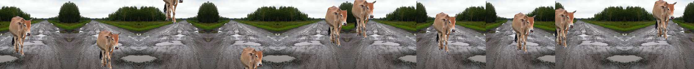
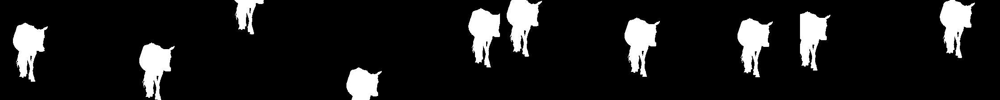

# Team Members(size=1):
   Name:Gadiraju Sanjay Varma
   
   Email:18pa1a1211@vishnu.edu.in
# Session-15 Assignment Journey
  * This is the most memorable course.I learned a lot from this course.Thank you  rohan sir for letting this course at such a affordable        price with hands-on  assignments.
  * Okay.Now this ReadMe tells the process and steps i followed for this Assignment
  * Let us start with my journey of predicting masks and depth images if we given background with foreground image and a background image.
# Data
 * Data is the most important part in the deep neural networks.
 * So a highly qualified iq brain with millions of neurons will be wasted if there is no knowledge in it.
 * In the same way if we have a deep learning model with tens and thousands of neurons and weights then it  will be wasted if we have no      knowledge about features,patterns,Textures,parts of object and object(just a basic understanding of model) in those weights.
 * So data is having utmost importance in development of neural network
 * Without data millions of skip connections,Millions of receptive fields will get wasted and they would be no use.
 * So i kept it in mind while developing data from my model.
 * There are two important steps in the data part of deep learning
    *     Data collection
    *     Data processing in right format so that neural network receives.

 ## Data Collection
 
 ### Background image
 * So we now understood the importance of data.So now we will look into data collection.
 * Here initially i started with collection of background images.
 * I collected images the next day and send it to my team.
 * But my team members said that the images are not realistic and we are looking for some indian scene photos.
 * So i stared collecting the photos of indian backgrounds with my team mates for assignment 15A.
 * So the foreground object we choose is cow which is the most common animal on roads.
 * So we collected the Background images which are of some indian street photos which were covered with plastic, waste,roads and traffic     etc.
 * We filtered some of images and we spent msot of time for making the background more realistic.
 * Here are some of the images we collected for Background.
 * But after listening to your session we decided that background may or may not  be too realistic.So we also downloaded some animation    photos as background.
 ### background image
 
 
 
 ### Transparent Foreground image
 
 * so our work of collecting background images are completed so now we will start collecting foreground images especially transparent      images.
 * So initially we started collecting the foreground images (in our sense it is cow).We searched on internet about cows and we choose      the pictures where cow is most dominating in the pictures which might results in good depth and transparent images.So we started        collecting the cow images by working as team.
 * After collection of cow images we need to make them transparent.So we used this website called remove.bg where we just upload an        image and it will give the transparent images of foreground pbject by using machine learning.It is really cool.
 [link to remove.bg website](https://www.remove.bg/)
 * So by using this website we obtained the transparent images of cow.
 * However for several we still have to use lasso tool in Photoshop to make the foregrounds really stand out
 #### Transparent Foreground image
 
 
 ### Mask Calculation
 * So initially we have this transparent image with four channels while the extra channel is transparency channel
 * So our team looked upon the transparency channel and set the value 0 for pixel value 0 and pixel value 1 for value greater than 0
 * That gives good binary mask which is very good in quality of image.Even though it is not much useful to main assignment it is very       much helpful
 #### mask image of foreground
 
 
 ### Okay.We are on a good pace.We completed the process of data collection.Now we will look into the data preprocessing which is              crucial     step for our deep learning model.
 
 ## Data preprocessing for our model
 
  ### Foreground-background image generation
  * Now after we collected the foreground images and background images we started thinking of a algorithm of generating or laying fg on     bg
  * We almost spend a week on thinking about the placing of an foreground on background using image segmentation.
  * The main idea here is that we will do image segmentation of background image using [this colab](https://colab.research.google.com/github/lexfridman/mit-deep-learning/blob/master/tutorial_driving_scene_segmentation/tutorial_driving_scene_segmentation.ipynb).
  * The output of image will be a combination of some maps.We will try to find best place for our foreground object based on that map.
  * But after listening to your session i got that we can place the foreground object anywhere.Then we used good approach to place foreground on background
  We planned to pass 2000 images in a single batch to the Depth image generator. Since 1 background will have 2000 images with 100 foregrouds (each 20 times) and another 2000 for same foreground images flipped, we ran the batch twice, second time with foregrounds flipped.

* Below is the process for one batch. 
* **NOTE**: We did not separately save corresponding bg, since the way we processed the image, from the image number we can determing the bg image number that we used.

```
INPUT bg image, list of fg images
1 for each foreground in list
  1.1 repeat 20 times
    1.1.1. randomly pick a center point on image (two numbers in range 0 to 447 for x, y)
    1.1.2. randomly pick a scale between .3 and .6 indicating how much square area should fg overlap on bg
    1.1.3. resize the fg to scale and place it on top of bg centered at x, y calculated
    1.1.4. save it at 160x160 resolution in a zip folder
    1.1.5. calculate mask by setting a binary image to transparency channel of fg image, with trasparent = 0 amd non transparent=1
    1.1.6. save mask at 160x160 resolution
    1.1.7. add 448x448 image to numpy array for depth calculation
1.3 if 100 images generated then yield the batch
  
2. run depth for one batch
3. save depth images of 160x160 in zipfolder
```
* Here we used perspective projection which means that if foreground object is in bottom of image then we will increse its scale
  because we assume that it is near to us.
 * If a foreground image is in above portion of image we are going to choose small scale since it is away from camera which is assumed by us.
 ### Example of foreground_background image
 
 
 ## Mask calculation of foreground_background image
 * So when we are generating the foreground_background image we are using **Image.paste()** which is the best function used in image processing.
 * So in that function we are using foreground image to paste on backgroound image using some co-ordinates which were obtained in random order between some range
 * Now we will create a black image with size of background image.
 * Now we will store that co-ordinates and we will paste the foreground on black image at that co-ordinate.
 * Now we will go through the image(iterate) and if there is any value greater than 0 we will make it as 1 otherwise we will make it as 0.
 * So by using this method we generated the mask of cow which is layed on background image.
 ### here are some of the images which are obtained from the mask of fg_bg image
 
 
## Depth Calculation
* We used nyu.h5 model for depth calcualtion from [dense depth](https://github.com/ialhashim/DenseDepth). This model requires input        images to be of 448x448 resolution and produces 224x224 size depth image. We planned to run it with a batch of 1000.
* Since we run 2000 images at a time now we wil generate 2000 images of size 224X224.Now we will scale those images to 448X448 because the model which we are using for generation of depth images will accept the input of 448X448.It produces the output of 224X224.After getting those images we will resize them to 160X160 size which is a compromise we took for speed and accuracy
* Now in the batch we are generating 2000 images and we will send all those images to depth prediction and save it to zip folder directly.
* Now we will use those images for our deep neural network.
### here are some of the examples for calculation of depth images for fg_bg image 
 
 
 ## Problems we faced and how we solved it during data processing
 * The first problem is generation of 1200K images!!!!!!!!!!!!!!!!.
 * The input and output operations performed in drive are very limited.So we cannot save 1200K images ondrive easily
 * When we are saving images in drive it will also create the preview of that images which results in lot of time consumption.
 * so we will generate the zip file where we are saving images in the zip file where drive will not generate the preview which results 
  in saving of time.
  * Also we are transferring only one file (independent of size) zip file.so we can transfer it to drive.
  * The zip file size if 3.2 GB.
  * After Extraction the size will be around 4 GB
 
 ### Hello sir.Okay we now also completed the data processing steps which is most crucial for our deep neural network
 [Here is the link to our colab file for complete data processing steps]()
 
 # Data Loading in Colab file
 * The data loading means making our data feasible such that our network will accept the data and produce the results.
 * Here the data loading in colab file is divided into many parts.We will explain each of the parts in detail.
 * 1) Bringing the zip file from google drive to our colab virtual environment directory.
 * 2) Extracting the zip file in the local colab virtual environment directory.
 
 ## Bringing the zip file from google drive to our colab virtual environment directory.
 * Now we completed the making of data.we have to load the data into our google colab.We can even work on our drive but the i/o operations performing on drive are very less.So we have to save them intoo our local colab machine.
 * I just performed the series of steps which worked really well.Since google colab s cloud based engine it is just sharing data so process is very easy.
 * Now initially we have to mount our drive to google colab.So by doing this we will get access to our drive form our colab.This makes life easier for small datasets.
 * Now we have to create folder in drive where we will have the background images and zip file for accessing.
 ### code for mounting our drive
 ```
   from google.colab import drive
   drive.mount('/content/drive')
 
 ```
* So after mounting drive we will make a directory in colab vm ***data*** where our data will be stored.
* Now we have to take that folder in drive and drag and drop the folder to our local colab file data
* After drag and drop our contents section will get struck(i suppose the copying of file is happening).Wait for a minute and **turn off internet and dont restart runtime.After two minutes turn on your internet and let google colab conect itself.**
* Now open data folder.Surprise!!!!!!!! the data is presented there.We have the zip file and bg images in that.Now when we go to drive we can find that our folder is deleted in drive.
*  DONT WORRY we can go to trash and restore it(Google is great).
* Now we got the zip file and bg images in our colab vm.

## Extracting the zip file in the local colab virtual environment directory.
 * Now we have the  zip file now we need to extract the colab file.So we need to go to the folder by using **cd** option in colab.
 * Next we need to run the below code to keep the zip file extracted portion in our same directory
 ```
 import time
start=time.time()
from zipfile import ZipFile
# Create a ZipFile Object and load sample.zip in it
#Copy of fgbganddepth_finaldata.zip is name of our zip file
with ZipFile('Copy of fgbganddepth_finaldata.zip', 'r') as zipObj:
# Extract all the contents of zip file in current directory
  zipObj.extractall()
print(time.time()-start)
 
 ```
 * The below code will extract the zip file and place it in same directory.
 * It took around 5 minutes for complete extraction of 5 GB.
 
 ### Hello sir now we also completed the extraction of zip file in colab local virtual machine folder.Next we will look into the loading of data so that our network takes it
 
 # Loading of data in batches for our network
 
 * Loading of data in bacthes is one of the most important part in neural network.
 * Loading of data in batches has many advantages like good loss backpropagation and identifying more generalized features.
 * Hence we prefer loading data in batches to our network.
 The loading of data in batches has several steps:
 * 1) Resizing them so that every image follows the rule of architecture(i.e) input and output size.(This is my team personal                  mistake.We forget to resize depth images,So i have to to do it everytime.)
  * 2) Having an access to all the respective files of images.
  * 3) Making sure we have all the inputs and ouputs in a single list so accessing them would be easier and also shuffling them also            would be easier
  * 4) visualization of the dataset list folder images
  * 5) Splitting the entire images into two sets one is train dataset and other is test dataset.
  * 6) Finding mean and standard deviation of the foreground and background,background,mask and depth images.
  * 7) Main part loading the dataset int the format of batches by creating a class
  * 8) Applying the transformations
  * 9) Loading the dataset by calling the dataset
  * 10) Loading the dataset by calling Dataloder class
  * 11) Finally Visualizing the dataset
  
  
## Resizing them so that every image follows the rule of architecture(i.e) input and output size.(This is my team personal                  mistake.We forget to resize depth images,So i have to to do it everytime.)
* One of the mistakes that we did while doing assignments is the size of images.We confirmed the size as 224X224 but we left the size of   background and depth as 448X448.So it is a major issue and it consumes a lot of time.
* But after realizing this we again ran an script to resize images in such a way we would benefit from both speed and accuracy.So we pick an size 160X160.Then we permanently made those changes in the zip folder.
* But we have to do resize of background images because i forgot about them and i need to resize them to 160X160 everytime so that all the images is of same size.
* Generally the resizing took only 1 second bcz we have to resize only 100 background images and since we are copying paths there is no need to have 400K background images.
* After doing the resize every image is in the shape of 160X160 which is good.
* So these are the resizes which are being done during this assignment.
 

  
  ## Having an access to all the respective files of images
  * So after extracting the dataset we need to access the files.
  * One way of accessing of files is by storing the images in a list.NOOO that woulg be memory intensive and takes a lot of memory.
  * Next method is by storing the paths.So one advantage is that if we store the images in paths there will be no memory intensive tasks.
  * Next is when we are trying to access the images during training,intially we will read images from paths and will send into neural network.
  * I followed this approach in a small dataset and for one epoch for loading paths took 44 secinds to complete while one epoch for         loading images took 35 seconds which is  faster but our dataste is larger so we will use loading paths format.
  * Below is the code for storing paths of images into a list
  ### foreground on background code for loading path into list

``` fg_bg_images=[]
from tqdm import tqdm_notebook
for i in tqdm_notebook(range(400000)):
      fg_bg_images+=["/content/data/dataset_forAssignment/output/images/fgbg{}.jpg".format(str(i).zfill(6))]
```
  

  ### loading background images paths into a list
  
  ```
  bg_images=[]
for i in tqdm_notebook(range(1,7)):
      for k in range(4000):
        bg_images+=["/content/data/dataset_forAssignment/bg_images/Copy of bgimg{}.jpg".format(str(i).zfill(3))]
  ```
  * Here we are storing each background image path 4000 times because each background images give 4000 images.
  
  ### loading mask images paths in list
  
  
  ```
  
  masks_images=[]
for i in tqdm_notebook(range(24000)):
      masks_images+=["/content/data/dataset_forAssignment/output/masks/mask{}.jpg".format(str(i).zfill(6))]
  ```
  
  ### loading depth images paths into list
  
  ```
  depth_images=[]
for i in tqdm_notebook(range(24000)):
      depth_images+=["/content/data/dataset_forAssignment/output/depth/fgbg{}.jpg".format(str(i).zfill(6))]
  ```
  
 * In this code we will load the foreground lay on background images **paths** into a list.
 * This similar approach is used for the depth images,background images and mask images.
 * So now we have access to all the files in the dataset in the format of the paths.
 
 ## Making sure we have all the inputs and ouputs in a single list so accessing them would be easier and also shuffling them also            would be easier

* So we initially loaded the fg_bg images,bg images,mask images and depth images **paths** into respective lists.
* But it will not help us because the accessing will not be easier and for any input there will be a fixed output only.
* So we need to maintain their relationship and at the same time we also have to  random shuffle and also easier accessing.OMG is it       possible?????
* Yes it is possible.Now we want to consider in such a way that all the index 0 elements are belonged to one set and all the index1 elements are belonged to one set and so on. 
* So we need to use below code such that all the list elements will be arranges such that all the same index elements form a nested list item.
```
Example:
input:[1,2,3],output=[4,5,6]
dataset=list(zip(input,output))
dataset=[[1,4],[2,5],[3,6]]

code:
dataset=list(zip(fg_bg_images,bg_images,masks_images,depth_images))
random.shuffle(dataset)
```
### So by this we will contain all inputs,outputs into a nested list

* So by using the above code we are going to have all the respective lists into single lists and easier for random shuffling and accessing.
* random.shuffle(dataset) will help us to shuffle the list so we can have images not in particular order.

## Visualization of the dataset folder by using the list.
* Let us consider the dataset folder is one which contains all the respective nested lists.
* Now below is the code fro displaying of images in those dataset folder.
```
# just some random visualization of the dataset folder
img1=Image.open(dataset[10][0])  #foreground_background image
display(img1)
img1=Image.open(dataset[10][1])  #background image
display(img1)
img1=Image.open(dataset[10][2])  # mask image
display(img1)
img1=Image.open(dataset[10][3])  # depth image
display(img1)


```


* So by using this dataset method we have a lot of flexibility for this method.

## Splitting the dataset folder into two sets which are train set and test set

* So here we have a dataset folder where it contains all the images inside nested lists in it.
* So we need to divide this dataset into two parts such that train part gets 70% of dataset folder and test part contains 30% of dataset folder.
* Now we can apply different procedures that are applied to train on train folder and to test on test transforms
* Below is the code for the division of dataset folder into train and test folder.
```
train_dataset=[x for i,x in enumerate(dataset) if (i<(0.7*len(dataset)))] 
test_dataset=[x for i,x in enumerate(dataset[(int)(0.7*len(dataset)):]) if (i<(0.3*len(dataset)))]

# here we are taking length of dataset folder for division of the folder into two parts.
```

## Clearing of lists

* Here we have so many lists which contain around 4 lahks data which occupy data and memory in ram.So we need to clear all the lists after getting train_dataset and test_dataset.

* Below is the code for clearing the lists
```
depth_images.clear()
masks_images.clear()
bg_images.clear()
fg_bg_images.clear()
dataset.clear()
```
* It is a python function which cleares all the data in a particular list.
* It reduces the ram usage and help us get out of cuda out of memory error. 

## Calculation of mean and standard deviation
* Mean and standard deviation are very important for a dataset.The pixel values in an image may be around 0-255.
* So the gradient will be diminished or overflowed because of the large scale in which the images pixels ranged.
* So we have to find the mean and standerd deviation in order to be the images in between 0 and 1
* We will subtract each pixel by it's mean and divide by it's standard deviation in order to be in between 0 and 1
* So finding mean and standard deviation is very important.
* So in order for faster calculation of mean and standard deviation i used **cupy which is a gpu version of numpy which is 10 times faster than numpy**.
* But pytorch doesnt work with cupy so you can use it only for intenesive operation like these where pytorch is not used.
* Below is the code for finding mean and standard deviation.

### code for calculation of mean and standard deviation of foreground_background image
```
from tqdm import tqdm_notebook
from PIL import Image
import numpy as np
import cupy as cp 
'''numpy executes on cpu even though you are on gpu.So i am using cupy which will execute on gpu and 10 times faster than numpy only on larger operations'''
import glob
n = 0
s = cp.zeros(3)
sq = cp.zeros(3)
for file in tqdm_notebook(glob.glob('/content/data/dataset_forAssignment/output/images/*.jpg')):
  data=Image.open(file)
  x = cp.array(data)/255
  s += x.sum(axis=(0,1))
  sq += cp.sum(cp.square(x), axis=(0,1))
  n += x.shape[0]*x.shape[1]

mu = s/n
std = cp.sqrt((sq/n - cp.square(mu)))
print(mu, sq/n, std, n)
```
* here mu represents mean and std represenst standard deviation which will print the results.


### code for calculation of mean and standard deviation of background image
```
from tqdm import tqdm_notebook
from PIL import Image
import numpy as np
import cupy as cp 
'''numpy executes on cpu even though you are on gpu.So i am using cupy which will execute on gpu and 10 times faster than numpy only on larger operations'''
import glob
n = 0
s = cp.zeros(3)
sq = cp.zeros(3)
for file in tqdm_notebook(glob.glob('/content/data/dataset_forAssignment/bg_images/*.jpg')):
  data=Image.open(file)
  x = cp.array(data)/255
  s += x.sum(axis=(0,1))
  sq += cp.sum(cp.square(x), axis=(0,1))
  n += x.shape[0]*x.shape[1]

mu = s/n
std = cp.sqrt((sq/n - cp.square(mu)))
print(mu, sq/n, std, n)
```
* here mu represents mean and std represenst standard deviation which will print the results.


### code for calculation of mean and standard deviation of depth image
```
from tqdm import tqdm_notebook
from PIL import Image
import numpy as np
import cupy as cp 
'''numpy executes on cpu even though you are on gpu.So i am using cupy which will execute on gpu and 10 times faster than numpy only on larger operations'''
import glob
n = 0
s = cp.zeros(1) #since it is having only one channel we are taking it having a length of only one
sq = cp.zeros()
for file in tqdm_notebook(glob.glob('/content/data/dataset_forAssignment/output/depth/*.jpg')):
  data=Image.open(file)
  x = cp.array(data)/255
  s += x.sum(axis=(0,1))
  sq += cp.sum(cp.square(x), axis=(0,1))
  n += x.shape[0]*x.shape[1]

mu = s/n
std = cp.sqrt((sq/n - cp.square(mu)))
print(mu, sq/n, std, n)
```
* here mu represents mean and std represenst standard deviation which will print the results.


### code for calculation of mean and standard deviation of masks image
```
from tqdm import tqdm_notebook
from PIL import Image
import numpy as np
import cupy as cp 
'''numpy executes on cpu even though you are on gpu.So i am using cupy which will execute on gpu and 10 times faster than numpy only on larger operations'''
import glob
n = 0
s = cp.zeros(3)
sq = cp.zeros(3)
for file in tqdm_notebook(glob.glob('/content/data/dataset_forAssignment/output/masks/*.jpg')):
  data=Image.open(file)
  x = cp.array(data)/255
  s += x.sum(axis=(0,1))
  sq += cp.sum(cp.square(x), axis=(0,1))
  n += x.shape[0]*x.shape[1]

mu = s/n
std = cp.sqrt((sq/n - cp.square(mu)))
print(mu, sq/n, std, n)
```
* here mu represents mean and std represenst standard deviation which will print the results.

# Main part loading the dataset in the format of batches by creating a class
 * Okay now we entered the first step of creating the images into batches
* Here we completed all the required steps to successfully convert images into batches
* So initially we will create a class say **get_dataset which inherits from Dataset class**.So usually this is a custom data so we are following this procedure.If this is a predefined dataset in pytorch then it will be in batches and it is a simple process.
* Now we need to override some functions in the Dataset in our own classes.
 * Pytorch is the most flexible framework for deep learning.Now we have loaded our data in the paths we have to talk about increasing      efficiency of our training loop.
 * So the main power of the fast execution of so many images comes in Vectorization
 * Vectorization means applying a particular operation without using explicit for loops.
 * It is faster by 400 times then normal implicit for loops.
 * So the developers and many people suggested to send images in format of batches so that we can utilize
   the power of Vectorization.
   * So pytorch provided a predefined class Dataset which helps us to return images in format of batches.
   * So there are two methods inside the Dataset class which are ``` __len__``` and ```get_item__``` which are very impoertant methods.
   * The first one will return the no of samples in the given dataset and second one is where you will get an index and you have to return  the input and output based on that index.
   * It is very simple and efficient.We can also apply transformations in this class while returning the image which provide so much convenience for us.
   * Below is the code i used to produce images in batches.
 
```class get_dataset(Dataset):
  def __init__(self,dataset,transforms=None):
    self.fg_bgimage,self.bg_image,self.mask_image,self.depth_image=zip(*dataset)
    self.transform=transforms
 
 
  def __len__(self):
    return (len(self.fg_bgimage))
    
  def __getitem__(self,index):
      if(torch.is_tensor(index)):
        index=index.tolist(index)
      input1=Image.open(self.fg_bgimage[index])
      input1.thumbnail((100,100))
      input1=np.asarray(input1)
      input2=(Image.open(self.bg_image[index]))
      input2=np.asarray(input2)
      output1=((Image.open(self.mask_image[index])))
      output1.thumbnail((100,100))
      output1=np.asarray(output1)
      output2=(Image.open(self.depth_image[index]))
      output2.thumbnail((100,100))
      output2=np.asarray(output2)
      output1=output1.transpose(1,0)/255
      output2=output2.transpose(1,0)
      if(self.transform):
        input1=self.transform[0](input1)
        input2=self.transform[1](input2)
        output1=self.transform[2](output1)
        output2=self.transform[3](output2)
      return input1,input2,output1,output
      ```
      
```

* Here we have a class named get_dataset which inherits properties from Dataset which is imported from pre-defined **torch.utils.data** function.
* In the constructor initially we will just store the paths and transforms locally in order for faster accessing.
* In the function **__len__** we need to return the length of images or objects in which the class need to act on.
* The function **__getitem__()** is one of the most important functions.Here the function will give an index as input to function and  we need to return values like input and output based on index.Like if you are having input and output in lists we can return the values by just specifying the list[index].By here you would have understood the flexibilty of pytorch.
* Since I am using paths i need to read the image in path and also need to apply transfromations where normalization should be done for better results.
* **Important thing.Intially i have images in size of 160x160 but i resized it to 100X100 for better batch size and i will explain why i did that in model section sir.**
* So for every image i resized it to 100x100 after reading image and i will apply tranformations.
* we can just return values form that function in any order but **remember you need to follow that order through out the project**.

### Errors i faced with dataloading into class:
* As i mentioned above that we can use cupy if we are having gpu which is used for faster accessing  but pytorch falis to initialize the runtime with cupy otherwise the speed should have improved by 10 times.


## Applying transformations to datasets
* Applying transformations to datasets is one of the most important aspect in the deep learning.
* if we have to increase the accuracy then we need more capacity or more data to train on.
* In first case to add more capacity then we need more amount of gpu to do work.
* So in this case we need to more data to work on but collection of data is very hard.So we will apply data transformations to get more variational data for training of a deep neural network.
* So for these purposes we will apply data transformations
* When we talk about the transformations i applied normalization on both foreground_background image,background image, depth image in both train and test transformations.
* The normalisation is important because it scales the value to be in between -1 to 1. 
* I cannot use cutdown or random erasing in this beacause it is a reconstruction problem.
* **It is not a classification problem like even though some portion of object is missing i can tell it as cow.Here we need mask of image so if some portion of image is missing then it should not be there in mask also. **
* Cutdown and random erasing follows random approach so it will also be difficult if we change our mask according to the ranodm erasing or  cutout.
* So i didint thought about the cutdown or random erasing techinques.
### Transfromations applied to foreground_background data
* For foreground_background image data i applied the normalization values to be in range of -1 to 1 so that different layers of kernals will not work on different range of values.
* So normalization is important and i used the above code for finding mean and standard deviation values.
* I did not apply the random erasing and cutout approach.That is the only transformation i applied.
* I tried applying **RGBshift** but albumentations is showing some error.So i did not applied that. 
* **I thought that my network should see the entire image without any disturbance so that reconstruction cna be done properly**

### Transfromations applied to background data
* For background image data i applied the normalization values to be in range of -1 to 1 so that different layers of kernals will not work on different range of values.
* So normalization is important and i used the above code for finding mean and standard deviation values.
* I did not apply the random erasing and cutout approach.That is the only transformation i applied.
* I tried applying **RGBshift** but albumentations is showing some error.So i did not applied that. 
* **I thought that my network should see the entire image without any disturbance so that reconstruction cna be done properly**
### Transfromations applied to depth data
* So depth data is very important so i also applied the normalization to it because it is having distribution of values.
* The values are in range of 0-255
* For depth image data i applied the normalization values to be in range of -1 to 1 so that different layers of kernals will not work on different range of values.
* So normalization is important and i used the above code for finding mean and standard deviation values.
* That is the only transfromation i have in mind of applying that.Because the depth image is an transformation we should not alter it.
### Transfromations applied to mask data
* So when i tried doing this assignment and i ahve to predict mask i have an idea on how mask should be.
* It should contain only two values 0 and 1.
* The normalization should not be applied on mask since it is not a distribution of values.
* So i didnt apply any transformatioms on mask since it is already in between 0 -1 and it is already good for gradient flow.
* So the mask is going into the network as it is.

### Below is the code for transformations of inputs and outputs.
```
from eva4datatransforms import AlbumentationTransforms
import albumentations.augmentations.transforms as A

# 12k images
mean_depth=(0.59492888)
std_depth=(0.25569079)
mean_fgbg=(0.4802258,0.52770951,0.52247662)
std_fgbg=(0.22515411,0.22905536,0.30719277)
mean_bg=(0.47247124,0.5431315,0.5466434)
std_bg=(0.21798535,0.22106706,0.30929284)
background_transforms=AlbumentationTransforms(
  [
   
   A.Normalize(mean=mean_bg, std=std_bg),
 
  ]  
  
)
depth_transforms=AlbumentationTransforms(
  [
   
   A.Normalize(mean=mean_depth, std=std_depth),
 
  ]  
  
)
fgbg_transforms=AlbumentationTransforms(
  [
   
   A.Normalize(mean=mean_fgbg, std=std_fgbg),
 
  ]  
  
)
mask_transforms=AlbumentationTransforms(
  [
   
  
  ]  
  
)
train_transforms=(fgbg_transforms,background_transforms,mask_transforms,depth_transforms)
background_transforms1=AlbumentationTransforms(
  [
   
   A.Normalize(mean=mean_bg, std=std_bg),
  ]  
  
)
depth_transforms1=AlbumentationTransforms(
  [
   
   A.Normalize(mean=mean_depth, std=std_depth),
 
  ]  
  
)
fgbg_transforms1=AlbumentationTransforms(
  [
   
   A.Normalize(mean=mean_fgbg, std=std_fgbg),
 
  ]  
  
)
mask_transforms1=AlbumentationTransforms(
  [
   
 
  ]  
  
)
test_transforms=(fgbg_transforms1,background_transforms1,mask_transforms1,depth_transforms1)

```

### Okay sir we have also completed the transformations of our inputs and outputs which are foredround_backgorund,background,depth,mask.Now let us move to next session before that drink some water sir:)

## Loading the dataset by calling the dataset

* So after defining the transformations and get_dataset class we need to define a method to call it.
* Below is a code that is used to define the dataset in batches
```
train=get_dataset(train_dataset,transforms=train_transforms)
test=get_dataset(test_dataset,transforms=test_transforms)
from eva4dataloaders import DataLoader
dataloader=DataLoader(batch_size=40) #since 40 is a multiple of 8
train_loader=dataloader.load(train)
test_loader=dataloader.load(test)
```
* Here get_dataset is a function which we defined above which will take train_dataset which is  a list that takes the index and return the values according to batches.
* transforms are the Albumentations transfromations which we defined for the images.
* Dataloader is the the main component which is going to call the images in batches.
* It will define parameteres like batch_size,pin_memory and num_workers which are used for parallel processing.
* It is going to change the parameters based on the device in which model is running.
* It is going to take data and take required parameters and it is going to release images into batches according to them.

## Visualizing the dataset.
* So intially we need to visualize the data after transformations because it will give us insight on what our model is looking and how it is looking the dataset.
* So it is very important to look at the changes the transformations made to your data.

## sir we both completed the entire loading of images which is good.Okay now we will move on to the model architecture.
# Model architecture input-100x100x3,100x100x3 then output-100x100x3,100x100x3,receptive field-201x201 at ending layer (The Main Engine behind deep learning)
### [Explaination video of this model architecture by me](https://www.youtube.com/watch?v=69mVVYxWF94&list=UUuYUdYjyqOhFkGE2SAJWBtQ)
### * So when i understood the assignment i am very much excited in developing the model.
### * Now the input to model is foreground_background image and next one is background image.
### * The output to model is depth image and mask image.
### * We have to understood that depth image and mask image are entirely two different images.
### * We cannot have same parameters of both of them.
### * we cannot have same loss functions for both of them.
### * So we need to figure out a way that we need to have two seperate convolutions for both outputs and seperate loss functions for both of them.
### * i tried many architectures but the results were not good.
### * I revised the entire notes i prepared from these 15  sessions i got down some important points.
### * Receptive field when i am preparing the architecture concept of receptive field is completely out of my mind.
### * So i implemented it and got good receptive field of 200x200 for input image size 100x100 by using dilated convolutions which is good.
### * Thank god i prepared the notes.

*  So here is the visual representation of my model using tensorboard.


* So i divided the model into four parts where i will explain about the four parts of my architecture design with code also.

### PART-1 OF MY CODE

### A quick remiander that first two paths belong to mask image and last two paths belong to depth image.Both of their implementations are same so initially i will explain the first two paths upto end and last two paths are same as first two paths.So please try to understand and i will also provide a video link for this architecture explaination in youtube by me.
 
* So now we can see in that figure that we have input box.
* So as i said we need to have **** two seperate covoutions ****  for mask and depth image .
* so i send fg_bg image to conv1 and bg image to conv20 which are mask path.
* The same fg_bg image and bg image are sent through conv_depth1 and conv_depth20 which are on the right size (last two).
* The input sizes of two images are same which are 100x100x3.
* So i send the fg_bg image through conv1,conv2,conv3,conv4.
* The code for those convolutions are not as detailed because i am using modular code but you can  basically understand.
```
    self.conv1=self.create_conv2d(3,16) #receptive field 3 input:100x100x3 output:100x100x16
    self.conv2=self.create_conv2d(16,16) #receptive field 5 input:100x100x16 output:100x100x16
    self.conv3=self.create_conv2d(16,32) #receptive field 7 input:100x100x16 output:100x100x32
    self.conv4=self.create_conv2d(32,32) #receptive field 9 input:100x100x32 output:100x100x32
```
* So we will get an image with 3 channels and we will proceed with channels 16,16 32,32 which is the order followed in embedding device.But to have greater batch size and faster training i used this architecture.
* We need to compromise sometimes :).
* So by self.conv4 we will have 32 channel image and we raeched a receptive field of 9.

* So i send the bg image through conv20,conv21,conv22,conv23.
* The code for those convolutions are not as detailed because i am using modular code but you can  basically understand.
```
    self.conv20=self.create_conv2d(3,16) #receptive field 3
    self.conv21=self.create_conv2d(16,16) #receptive field 5
    self.conv22=self.create_conv2d(16,32) #receptive field 7
    self.conv23=self.create_conv2d(32,32) #receptive field 9

```
* So we will get an image with 3 channels and we will proceed with channels 16,16 32,32.
* So by self.conv23 we will have 32 channel image and receptive field will be 9.

### Next we will concatenate the results obtained from self.conv23 with channels 32 and self.conv4 with channels 32 and we will get and output of channel size 64.
* The code explains clearly on the concatenation part
```
def forward(self,x1,x2):
    x1.requires_grad=False
    x2.requires_grad=False
    #first part for finding mask
    
    # operations of background image
    bg_image_mask=self.conv20(x2)
    bg_image_mask=self.conv21(bg_image_mask)
    bg_image_mask=self.conv22(bg_image_mask)
    bg_image_mask=self.conv23(bg_image_mask)

    output1=self.conv1(x1)
    output1=self.conv2(output1)
    output1=self.conv3(output1)
    output1=self.conv4(output1)
    output1=torch.cat((output1,bg_image_mask),1) #we are concatenating and we will get output of                                                     channels
```
* THe basic intuition behind this is the model gets the only necessary features from conv20-conv23
 of background for it's concatenation with conv4 output during backpropagation.
 * The model gets necessary features from conv1-conv4 and we will concatenate them.
 * This is the basic functionality of those convolutions in part-1 picture.
 
 
### PART-2 OF MY CODE

* Now we will get an output of100x100x64 channels from those concatenation part.
# * Now we can observe that the two paths are equal left and right side are equal.
# * So i will observe the left part which is mask part and you can also understand the depth part.
* So now we will send the input to conv5,conv6,conv7,conv8.
* Below is the code to implement those.
```
    self.conv5=self.create_conv2d(64,64,dilation=2,padding=2) #receptive field 13  input:100x100x64 output:100x100x64
    self.conv6=self.create_conv2d(64,64,dilation=4,padding=4) #receptive field 19 input:100x100x64 output:100x100x64
    self.conv7=self.create_conv2d(64,128,dilation=8,padding=8) #receptive field 29 input:100x100x64 output:100x100x128
    self.conv8=self.create_conv2d(128,64) #receptive field 31 input:100x100x128 output:100x100x64
    
```
* So here earlier i talked about a important concept **Receptive Field**
* So to increase receptive fields we need to use dilated convolutions.
* Dilated convolutions are used to increase the receptive field by maintaining same kernal size by increasing dilation size.
```
The receptive field formula is Rout=Rin+(k-1)*stride //for dilation kernal size=dilation+keral_size
```
* So the receptive filed increased by 13,19,29,31 respectively.

* **After that conv8 we can see a path generating from it.It is skip connection.SO i will add it to another ouput before ending so that we can have multiple receptive fields.**

* SO by here we completed the part-2 of diagram where we send from conv5,conv6,conv7,conv8.Next we will send to conv9 which we will see in part3.Similar architecture is also followed in right side also which is predicting depth.

* Code where we are sending from conv5-conv8 for part2
```
    output1=self.conv5(output1)
    output1=self.conv6(output1)
    output1=self.conv7(output1)
    output1=self.conv8(output1)
    self.concat1=output1 # this self.concat1 holds the tensors for skip connection.
```
* The intuition is that we will send the input through conv5 where our model will try to learn better and better after each convolution.

 
### PART-3 OF MY CODE


* So after conv8 we can continue like that without decreasing the size but the no of layers will also be increased.
* So we have to decrease the size of image by maxpooling or 3x3 with stride 2 so that size will be reduced and also the receptive field increses 2 times from now.
*  So firstly we will look into the code of part-3 convolutions.**I am remianding once again that left and right side structures are same.you can have a look into my video if you didnt understood my architecture at once.**
* **We can also find a dark thick line beside our convolution path which is skip connection.**
```
    # it is a 3x3 convolution with stride2 for decreasing in size of image.
    self.conv9=self.create_conv2d(64,16,stride=2,padding=1) #receptive field 33 input:100x100x64 output:50x50x16
    self.conv10=self.create_conv2d(16,16) #receptive field 37 input:50x50x16 output:50x50x16
    self.conv11=self.create_conv2d(16,32,dilation=2,padding=2) #receptive field 45 input:50x50x16 output:50x50x32
    self.conv12=self.create_conv2d(32,32,dilation=4,padding=4) #receptive field 57 input:50x50x32 output:50x50x32
    self.conv13=self.create_conv2d(32,64,dilation=8,padding=8) #receptive field 77 input:50x50x32 output:50x50x64
    self.conv14=self.create_conv2d(64,64,dilation=16,padding=16) #receptive field 113 input:50x50x64 output:50x50x64
    self.conv15=self.create_conv2d(64,128,dilation=16,padding=16) #receptive field 149
    input:50x50x64 output:50x50x128
```
* In conv9 we will get an input of 100x100x64 and the output will be 50x50x16.
* Here instead of maxpooling we used 3x3 with stride 2 for better performance.It reduces the size by 2.
* Next we will send it conv10,conv11,conv12,conv13,conv14,conv15 which will manipulate the no of channnels but not with size.
* **You can see that i used dilation value in conv11 but not in conv10 because i just applied the reduction in size so to stabilize the values and adding capacity i didnt used the dilation in conv10 **
* In the conv11,conv12,conv13,conv14 and conv15. I increased the dilation in 2 times to its previous dilation value everytime which leads to jump in receptive field.

* The channels of images followed as 16,32,32,64,64,128 which is of a embedding type of architecture.
* **My intuition is that since we need to identify only patterns i thought that 128  channels are good enough.**

* With increase in the dilation the padding is also increased to  maintain the same image size.
* The below code which we used in forward propagation for the part-3
```
    output1=self.conv9(output1)
    output1=self.conv10(output1)
    output1=self.conv11(output1)
    output1=self.conv12(output1)
    output1=self.conv13(output1)
    output1=self.conv14(output1)
    output2=self.conv_depth15(output2)
```
### PART-4 (final)OF MY CODE


* In part-4 we have conv16,conv17,upsample,concatenation,conv18,conv19.
* The code used for the part-4 diagram
```
 self.conv_depth16=self.create_conv2d(128,64,dilation=16,padding=16) #receptive field 185 input-image:50x50x128 output:50x50x64
    self.conv_depth17=self.create_conv2d(64,64) #receptive field 189 input-image:50x50x64 output:50x50x64
    self.upsampling2=nn.Upsample((100,100), mode='nearest') #receptive field 193 formula is 2^(no of sampling layers)*(kernalsize-1) 
    self.conv_depth18=self.create_conv2d(128,128) #receptive field 197 input-image:100x100x128 output:100x100x128
    self.conv_depth19=self.create_conv2d(128,1,bn=False, dropout=0, relu=False) #receptive field 201 input:100x100x128 output:100x100x1
    
```
* So from conv15 the output will be 50x50x128 and we will send it to conv16.The output form conv16 will be 50x50x64.
* Then we will send it to conv17 where the input is 50x50x64 and output is 50x50x64
* Then we will send it to upsampling because we need to add skip connection to the variable and they should be of same size.So the skip connection is of size 100x100x64 so we need to convert present varible to size 100x100x64 which is of size 50x50x64.
* So after upsampling we have to concatenate and now we have multiple receptive fields.
* After concatenation we will have 128 channels  of shape 100x100x128.
* In conv18 we will convolve on this one and obtain 128 channels of size 100x100 again.
* In conv19 which is  a final convolution we convert our 128 channels to single channel which will be our depth image.
* The code which is used in forward propagation is
```
    output1=self.conv16(output1)
    output1=self.conv17(output1)
    output1=self.upsampling1(output1)
    output1=torch.cat((output1,self.concat1),1)
    output1=self.conv18(output1)
    output1=self.conv19(output1)
```

* So finally our receptive filed will be 201x201.My intuition while developing this architecture is i should have good receptive field and i should use dilated convolutions for increase in receptive field and knowing more wider context.

* We should have two blocks so that i can capture textures and pattrens which are enough for mask and deoth dataset.
* I used an upsampling layer for going back to original size.
```
 self.upsampling2=nn.Upsample((100,100), mode='nearest') 
```
* That is the complete architecture.I explained the code for the mask path and it is similar to depth path also.
* Here is the complete code for the model architecture.
```

 
class Net(nn.Module):
    """
    Base network that defines helper functions, summary and mapping to device
    """
    def conv2d(self, in_channels, out_channels, kernel_size=(3,3), dilation=1, groups=1, padding=1, bias=False, padding_mode="zeros",stride=1):
      return [nn.Conv2d(in_channels=in_channels, out_channels=out_channels, kernel_size=kernel_size, groups=groups, dilation=dilation, padding=padding, bias=bias, padding_mode=padding_mode,stride=stride)]
 
    def separable_conv2d(self, in_channels, out_channels, kernel_size=(3,3), dilation=1, padding=1, bias=False, padding_mode="zeros"):
      return [nn.Conv2d(in_channels=in_channels, out_channels=in_channels, kernel_size=kernel_size, groups=in_channels, dilation=dilation, padding=padding, bias=bias, padding_mode=padding_mode),
              nn.Conv2d(in_channels=in_channels, out_channels=out_channels, kernel_size=(1,1), bias=bias,padding=0)]
 
    def activate(self, l, out_channels, bn=True, dropout=0, relu=True,max_pooling=0):
      if(max_pooling>0):
        l.append(nn.MaxPool2d(2,2))
      if bn:
        l.append(nn.BatchNorm2d(out_channels))
      if dropout>0:
        l.append(nn.Dropout(dropout))
      if relu:
        l.append(nn.ReLU())
 
      return nn.Sequential(*l)
 
    def create_conv2d(self, in_channels, out_channels, kernel_size=(3,3), dilation=1, groups=1, padding=1, bias=False, bn=True, dropout=0, relu=True, padding_mode="circular",max_pooling=0,stride=1):
      return self.activate(self.conv2d(in_channels=in_channels, out_channels=out_channels, kernel_size=kernel_size, groups=groups, dilation=dilation, padding=padding, bias=bias, padding_mode=padding_mode,stride=stride), out_channels, bn, dropout, relu,max_pooling)
 
    def create_depthwise_conv2d(self, in_channels, out_channels, kernel_size=(3,3), dilation=1, padding=1, bias=False, bn=True, dropout=0, relu=True, padding_mode="circular"):
      return self.activate(self.separable_conv2d(in_channels=in_channels, out_channels=out_channels, kernel_size=kernel_size, dilation=dilation, padding=padding, bias=bias, padding_mode=padding_mode),
                 out_channels, bn, dropout, relu)
 
    def __init__(self, name="Model"):
        super(Net, self).__init__()
        self.trainer = None
        self.name = name
 
    def summary(self, input_size,input_size1): #input_size=(1, 28, 28)
      summary(self, input_size=[input_size,input_size1])
 
    def gotrain(self,model, optimizer, train_loader, test_loader, epochs, statspath,criterion,writer,scheduler=None, batch_scheduler=False, L1lambda=0):
      self.trainer = ModelTrainer(model,optimizer, train_loader, test_loader, statspath,criterion,writer,scheduler,batch_scheduler, L1lambda)
      #print("hello")
      self.trainer.run(epochs)
 
    def stats(self):
      return self.trainer.stats if self.trainer else None
 

class depth_model_new(Net):
  def __init__(self,name="Model",dropout_value=0.0):
    super(depth_model_new,self).__init__(name)
    #first part of architecture of solving the mask image
    self.conv1=self.create_conv2d(3,16) #receptive field 3
    self.conv2=self.create_conv2d(16,16) #receptive field 5
    self.conv3=self.create_conv2d(16,32) #receptive field 7
    self.conv4=self.create_conv2d(32,32) #receptive field 9
    self.conv5=self.create_conv2d(64,64,dilation=2,padding=2) #receptive field 13
    self.conv6=self.create_conv2d(64,64,dilation=4,padding=4) #receptive field 19
    self.conv7=self.create_conv2d(64,128,dilation=8,padding=8) #receptive field 29
    self.conv8=self.create_conv2d(128,64) #receptive field 31
    self.conv9=self.create_conv2d(64,16,stride=2,padding=1) #receptive field 33
    self.conv10=self.create_conv2d(16,16) #receptive field 37
    self.conv11=self.create_conv2d(16,32,dilation=2,padding=2) #receptive field 45
    self.conv12=self.create_conv2d(32,32,dilation=4,padding=4) #receptive field 57
    self.conv13=self.create_conv2d(32,64,dilation=8,padding=8) #receptive field 77
    self.conv14=self.create_conv2d(64,64,dilation=16,padding=16) #receptive field 113
    self.conv15=self.create_conv2d(64,128,dilation=16,padding=16) #receptive field 149
    self.conv16=self.create_conv2d(128,64,dilation=16,padding=16) #receptive field 185
    self.conv17=self.create_conv2d(64,64) #receptive field 189
    self.upsampling1=nn.Upsample((100,100), mode='nearest') #receptive field 193 formula is 2^(no of sampling layers)*(kernalsize-1)
    self.conv18=self.create_conv2d(128,128) #receptive field 197
    self.conv19=self.create_conv2d(128,1,bn=False, dropout=0, relu=False) #receptive field 201
    
    #operations used by our background image
    self.conv20=self.create_conv2d(3,16) #receptive field 3
    self.conv21=self.create_conv2d(16,16) #receptive field 5
    self.conv22=self.create_conv2d(16,32) #receptive field 7
    self.conv23=self.create_conv2d(32,32) #receptive field 9

    #first part of architecture of solving the depth image
    self.conv_depth1=self.create_conv2d(3,16) #receptive field 3
    self.conv_depth2=self.create_conv2d(16,16) #receptive field 5
    self.conv_depth3=self.create_conv2d(16,32) #receptive field 7
    self.conv_depth4=self.create_conv2d(32,32) #receptive field 9
    self.conv_depth5=self.create_conv2d(64,64,dilation=2,padding=2) #receptive field 13
    self.conv_depth6=self.create_conv2d(64,64,dilation=4,padding=4) #receptive field 19
    self.conv_depth7=self.create_conv2d(64,128,dilation=8,padding=8) #receptive field 29
    self.conv_depth8=self.create_conv2d(128,64) #receptive field 31
    self.conv_depth9=self.create_conv2d(64,16,stride=2,padding=1) #receptive field 33
    self.conv_depth10=self.create_conv2d(16,16) #receptive field 37
    self.conv_depth11=self.create_conv2d(16,32,dilation=2,padding=2) #receptive field 45
    self.conv_depth12=self.create_conv2d(32,32,dilation=4,padding=4) #receptive field 57
    self.conv_depth13=self.create_conv2d(32,64,dilation=8,padding=8) #receptive field 77
    self.conv_depth14=self.create_conv2d(64,64,dilation=16,padding=16) #receptive field 113
    self.conv_depth15=self.create_conv2d(64,128,dilation=16,padding=16) #receptive field 149
    self.conv_depth16=self.create_conv2d(128,64,dilation=16,padding=16) #receptive field 185
    self.conv_depth17=self.create_conv2d(64,64) #receptive field 189
    self.upsampling2=nn.Upsample((100,100), mode='nearest') #receptive field 193 formula is 2^(no of sampling layers)*(kernalsize-1)
    self.conv_depth18=self.create_conv2d(128,128) #receptive field 197
    self.conv_depth19=self.create_conv2d(128,1,bn=False, dropout=0, relu=False) #receptive field 201
    
    #operations used by our background image
    self.conv_depth20=self.create_conv2d(3,16) #receptive field 3
    self.conv_depth21=self.create_conv2d(16,16) #receptive field 5
    self.conv_depth22=self.create_conv2d(16,32) #receptive field 7
    self.conv_depth23=self.create_conv2d(32,32) #receptive field 9

  def forward(self,x1,x2):
    x1.requires_grad=False
    x2.requires_grad=False
    #first part for finding mask
    
    # operations of background image
    bg_image_mask=self.conv20(x2)
    bg_image_mask=self.conv21(bg_image_mask)
    bg_image_mask=self.conv22(bg_image_mask)
    bg_image_mask=self.conv23(bg_image_mask)

    output1=self.conv1(x1)
    output1=self.conv2(output1)
    output1=self.conv3(output1)
    output1=self.conv4(output1)
    output1=torch.cat((output1,bg_image_mask),1)
    output1=self.conv5(output1)
    output1=self.conv6(output1)
    output1=self.conv7(output1)
    output1=self.conv8(output1)
    self.concat1=output1
    output1=self.conv9(output1)
    output1=self.conv10(output1)
    output1=self.conv11(output1)
    output1=self.conv12(output1)
    output1=self.conv13(output1)
    output1=self.conv14(output1)
    output1=self.conv15(output1)
    output1=self.conv16(output1)
    output1=self.conv17(output1)
    output1=self.upsampling1(output1)
    output1=torch.cat((output1,self.concat1),1)
    output1=self.conv18(output1)
    output1=self.conv19(output1)


   # operations on depth image
    bg_image_depth=self.conv_depth20(x2)
    bg_image_depth=self.conv_depth21(bg_image_depth)
    bg_image_depth=self.conv_depth22(bg_image_depth)
    bg_image_depth=self.conv_depth23(bg_image_depth)

    output2=self.conv_depth1(x1)
    output2=self.conv_depth2(output2)
    output2=self.conv_depth3(output2)
    output2=self.conv_depth4(output2)
    output2=torch.cat((output2,bg_image_depth),1)
    output2=self.conv_depth5(output2)
    output2=self.conv_depth6(output2)
    output2=self.conv_depth7(output2)
    output2=self.conv_depth8(output2)
    self.concat2=output2
    output2=self.conv_depth9(output2)
    output2=self.conv_depth10(output2)
    output2=self.conv_depth11(output2)
    output2=self.conv_depth12(output2)
    output2=self.conv_depth13(output2)
    output2=self.conv_depth14(output2)
    output2=self.conv_depth15(output2)
    output2=self.conv_depth16(output2)
    output2=self.conv_depth17(output2)
    output2=self.upsampling2(output2)
    output2=torch.cat((output2,self.concat2),1)
    output2=self.conv_depth18(output2)
    output2=self.conv_depth19(output2)
 
    return output1,output2

```
# [explaination video of this model in two minutes] 

## why i am not using 160x160 instead of 100x100 in image size
* So torch.summary is actually a good program to find the size occupied by model in ram.So when i ran the torch.summary my model is using  23 Gb storage in ram.Here is the output by 160x160 image in torch summary
```
----------------------------------------------------------------
        Layer (type)               Output Shape         Param #
================================================================
            Conv2d-1         [-1, 16, 160, 160]             432
       BatchNorm2d-2         [-1, 16, 160, 160]              32
              ReLU-3         [-1, 16, 160, 160]               0
            Conv2d-4         [-1, 16, 160, 160]           2,304
       BatchNorm2d-5         [-1, 16, 160, 160]              32
              ReLU-6         [-1, 16, 160, 160]               0
            Conv2d-7         [-1, 32, 160, 160]           4,608
       BatchNorm2d-8         [-1, 32, 160, 160]              64
              ReLU-9         [-1, 32, 160, 160]               0
           Conv2d-10         [-1, 32, 160, 160]           9,216
      BatchNorm2d-11         [-1, 32, 160, 160]              64
             ReLU-12         [-1, 32, 160, 160]               0
           Conv2d-13         [-1, 16, 160, 160]             432
      BatchNorm2d-14         [-1, 16, 160, 160]              32
             ReLU-15         [-1, 16, 160, 160]               0
           Conv2d-16         [-1, 16, 160, 160]           2,304
      BatchNorm2d-17         [-1, 16, 160, 160]              32
             ReLU-18         [-1, 16, 160, 160]               0
           Conv2d-19         [-1, 32, 160, 160]           4,608
      BatchNorm2d-20         [-1, 32, 160, 160]              64
             ReLU-21         [-1, 32, 160, 160]               0
           Conv2d-22         [-1, 32, 160, 160]           9,216
      BatchNorm2d-23         [-1, 32, 160, 160]              64
             ReLU-24         [-1, 32, 160, 160]               0
           Conv2d-25         [-1, 64, 160, 160]          36,864
      BatchNorm2d-26         [-1, 64, 160, 160]             128
             ReLU-27         [-1, 64, 160, 160]               0
           Conv2d-28         [-1, 64, 160, 160]          36,864
      BatchNorm2d-29         [-1, 64, 160, 160]             128
             ReLU-30         [-1, 64, 160, 160]               0
           Conv2d-31        [-1, 128, 160, 160]          73,728
      BatchNorm2d-32        [-1, 128, 160, 160]             256
             ReLU-33        [-1, 128, 160, 160]               0
           Conv2d-34         [-1, 64, 160, 160]          73,728
      BatchNorm2d-35         [-1, 64, 160, 160]             128
             ReLU-36         [-1, 64, 160, 160]               0
           Conv2d-37           [-1, 16, 80, 80]           9,216
      BatchNorm2d-38           [-1, 16, 80, 80]              32
             ReLU-39           [-1, 16, 80, 80]               0
           Conv2d-40           [-1, 16, 80, 80]           2,304
      BatchNorm2d-41           [-1, 16, 80, 80]              32
             ReLU-42           [-1, 16, 80, 80]               0
           Conv2d-43           [-1, 32, 80, 80]           4,608
      BatchNorm2d-44           [-1, 32, 80, 80]              64
             ReLU-45           [-1, 32, 80, 80]               0
           Conv2d-46           [-1, 32, 80, 80]           9,216
      BatchNorm2d-47           [-1, 32, 80, 80]              64
             ReLU-48           [-1, 32, 80, 80]               0
           Conv2d-49           [-1, 64, 80, 80]          18,432
      BatchNorm2d-50           [-1, 64, 80, 80]             128
             ReLU-51           [-1, 64, 80, 80]               0
           Conv2d-52           [-1, 64, 80, 80]          36,864
      BatchNorm2d-53           [-1, 64, 80, 80]             128
             ReLU-54           [-1, 64, 80, 80]               0
           Conv2d-55          [-1, 128, 80, 80]          73,728
      BatchNorm2d-56          [-1, 128, 80, 80]             256
             ReLU-57          [-1, 128, 80, 80]               0
           Conv2d-58           [-1, 64, 80, 80]          73,728
      BatchNorm2d-59           [-1, 64, 80, 80]             128
             ReLU-60           [-1, 64, 80, 80]               0
           Conv2d-61           [-1, 64, 80, 80]          36,864
      BatchNorm2d-62           [-1, 64, 80, 80]             128
             ReLU-63           [-1, 64, 80, 80]               0
         Upsample-64         [-1, 64, 160, 160]               0
           Conv2d-65        [-1, 128, 160, 160]         147,456
      BatchNorm2d-66        [-1, 128, 160, 160]             256
             ReLU-67        [-1, 128, 160, 160]               0
           Conv2d-68          [-1, 1, 160, 160]           1,152
           Conv2d-69         [-1, 16, 160, 160]             432
      BatchNorm2d-70         [-1, 16, 160, 160]              32
             ReLU-71         [-1, 16, 160, 160]               0
           Conv2d-72         [-1, 16, 160, 160]           2,304
      BatchNorm2d-73         [-1, 16, 160, 160]              32
             ReLU-74         [-1, 16, 160, 160]               0
           Conv2d-75         [-1, 32, 160, 160]           4,608
      BatchNorm2d-76         [-1, 32, 160, 160]              64
             ReLU-77         [-1, 32, 160, 160]               0
           Conv2d-78         [-1, 32, 160, 160]           9,216
      BatchNorm2d-79         [-1, 32, 160, 160]              64
             ReLU-80         [-1, 32, 160, 160]               0
           Conv2d-81         [-1, 16, 160, 160]             432
      BatchNorm2d-82         [-1, 16, 160, 160]              32
             ReLU-83         [-1, 16, 160, 160]               0
           Conv2d-84         [-1, 16, 160, 160]           2,304
      BatchNorm2d-85         [-1, 16, 160, 160]              32
             ReLU-86         [-1, 16, 160, 160]               0
           Conv2d-87         [-1, 32, 160, 160]           4,608
      BatchNorm2d-88         [-1, 32, 160, 160]              64
             ReLU-89         [-1, 32, 160, 160]               0
           Conv2d-90         [-1, 32, 160, 160]           9,216
      BatchNorm2d-91         [-1, 32, 160, 160]              64
             ReLU-92         [-1, 32, 160, 160]               0
           Conv2d-93         [-1, 64, 160, 160]          36,864
      BatchNorm2d-94         [-1, 64, 160, 160]             128
             ReLU-95         [-1, 64, 160, 160]               0
           Conv2d-96         [-1, 64, 160, 160]          36,864
      BatchNorm2d-97         [-1, 64, 160, 160]             128
             ReLU-98         [-1, 64, 160, 160]               0
           Conv2d-99        [-1, 128, 160, 160]          73,728
     BatchNorm2d-100        [-1, 128, 160, 160]             256
            ReLU-101        [-1, 128, 160, 160]               0
          Conv2d-102         [-1, 64, 160, 160]          73,728
     BatchNorm2d-103         [-1, 64, 160, 160]             128
            ReLU-104         [-1, 64, 160, 160]               0
          Conv2d-105           [-1, 16, 80, 80]           9,216
     BatchNorm2d-106           [-1, 16, 80, 80]              32
            ReLU-107           [-1, 16, 80, 80]               0
          Conv2d-108           [-1, 16, 80, 80]           2,304
     BatchNorm2d-109           [-1, 16, 80, 80]              32
            ReLU-110           [-1, 16, 80, 80]               0
          Conv2d-111           [-1, 32, 80, 80]           4,608
     BatchNorm2d-112           [-1, 32, 80, 80]              64
            ReLU-113           [-1, 32, 80, 80]               0
          Conv2d-114           [-1, 32, 80, 80]           9,216
     BatchNorm2d-115           [-1, 32, 80, 80]              64
            ReLU-116           [-1, 32, 80, 80]               0
          Conv2d-117           [-1, 64, 80, 80]          18,432
     BatchNorm2d-118           [-1, 64, 80, 80]             128
            ReLU-119           [-1, 64, 80, 80]               0
          Conv2d-120           [-1, 64, 80, 80]          36,864
     BatchNorm2d-121           [-1, 64, 80, 80]             128
            ReLU-122           [-1, 64, 80, 80]               0
          Conv2d-123          [-1, 128, 80, 80]          73,728
     BatchNorm2d-124          [-1, 128, 80, 80]             256
            ReLU-125          [-1, 128, 80, 80]               0
          Conv2d-126           [-1, 64, 80, 80]          73,728
     BatchNorm2d-127           [-1, 64, 80, 80]             128
            ReLU-128           [-1, 64, 80, 80]               0
          Conv2d-129           [-1, 64, 80, 80]          36,864
     BatchNorm2d-130           [-1, 64, 80, 80]             128
            ReLU-131           [-1, 64, 80, 80]               0
        Upsample-132         [-1, 64, 160, 160]               0
          Conv2d-133        [-1, 128, 160, 160]         147,456
     BatchNorm2d-134        [-1, 128, 160, 160]             256
            ReLU-135        [-1, 128, 160, 160]               0
          Conv2d-136          [-1, 1, 160, 160]           1,152
================================================================
Total params: 1,340,224
Trainable params: 1,340,224
Non-trainable params: 0
----------------------------------------------------------------
Input size (MB): 22500.00
Forward/backward pass size (MB): 916.02
Params size (MB): 5.11
Estimated Total Size (MB): 23421.13
-------------------------------------
```
* you can see input size is 22500 MB
* let us see torch.summary of 100x100x3 size image
```
----------------------------------------------------------------
        Layer (type)               Output Shape         Param #
================================================================
            Conv2d-1         [-1, 16, 100, 100]             432
       BatchNorm2d-2         [-1, 16, 100, 100]              32
              ReLU-3         [-1, 16, 100, 100]               0
            Conv2d-4         [-1, 16, 100, 100]           2,304
       BatchNorm2d-5         [-1, 16, 100, 100]              32
              ReLU-6         [-1, 16, 100, 100]               0
            Conv2d-7         [-1, 32, 100, 100]           4,608
       BatchNorm2d-8         [-1, 32, 100, 100]              64
              ReLU-9         [-1, 32, 100, 100]               0
           Conv2d-10         [-1, 32, 100, 100]           9,216
      BatchNorm2d-11         [-1, 32, 100, 100]              64
             ReLU-12         [-1, 32, 100, 100]               0
           Conv2d-13         [-1, 16, 100, 100]             432
      BatchNorm2d-14         [-1, 16, 100, 100]              32
             ReLU-15         [-1, 16, 100, 100]               0
           Conv2d-16         [-1, 16, 100, 100]           2,304
      BatchNorm2d-17         [-1, 16, 100, 100]              32
             ReLU-18         [-1, 16, 100, 100]               0
           Conv2d-19         [-1, 32, 100, 100]           4,608
      BatchNorm2d-20         [-1, 32, 100, 100]              64
             ReLU-21         [-1, 32, 100, 100]               0
           Conv2d-22         [-1, 32, 100, 100]           9,216
      BatchNorm2d-23         [-1, 32, 100, 100]              64
             ReLU-24         [-1, 32, 100, 100]               0
           Conv2d-25         [-1, 64, 100, 100]          36,864
      BatchNorm2d-26         [-1, 64, 100, 100]             128
             ReLU-27         [-1, 64, 100, 100]               0
           Conv2d-28         [-1, 64, 100, 100]          36,864
      BatchNorm2d-29         [-1, 64, 100, 100]             128
             ReLU-30         [-1, 64, 100, 100]               0
           Conv2d-31        [-1, 128, 100, 100]          73,728
      BatchNorm2d-32        [-1, 128, 100, 100]             256
             ReLU-33        [-1, 128, 100, 100]               0
           Conv2d-34         [-1, 64, 100, 100]          73,728
      BatchNorm2d-35         [-1, 64, 100, 100]             128
             ReLU-36         [-1, 64, 100, 100]               0
           Conv2d-37           [-1, 16, 50, 50]           9,216
      BatchNorm2d-38           [-1, 16, 50, 50]              32
             ReLU-39           [-1, 16, 50, 50]               0
           Conv2d-40           [-1, 16, 50, 50]           2,304
      BatchNorm2d-41           [-1, 16, 50, 50]              32
             ReLU-42           [-1, 16, 50, 50]               0
           Conv2d-43           [-1, 32, 50, 50]           4,608
      BatchNorm2d-44           [-1, 32, 50, 50]              64
             ReLU-45           [-1, 32, 50, 50]               0
           Conv2d-46           [-1, 32, 50, 50]           9,216
      BatchNorm2d-47           [-1, 32, 50, 50]              64
             ReLU-48           [-1, 32, 50, 50]               0
           Conv2d-49           [-1, 64, 50, 50]          18,432
      BatchNorm2d-50           [-1, 64, 50, 50]             128
             ReLU-51           [-1, 64, 50, 50]               0
           Conv2d-52           [-1, 64, 50, 50]          36,864
      BatchNorm2d-53           [-1, 64, 50, 50]             128
             ReLU-54           [-1, 64, 50, 50]               0
           Conv2d-55          [-1, 128, 50, 50]          73,728
      BatchNorm2d-56          [-1, 128, 50, 50]             256
             ReLU-57          [-1, 128, 50, 50]               0
           Conv2d-58           [-1, 64, 50, 50]          73,728
      BatchNorm2d-59           [-1, 64, 50, 50]             128
             ReLU-60           [-1, 64, 50, 50]               0
           Conv2d-61           [-1, 64, 50, 50]          36,864
      BatchNorm2d-62           [-1, 64, 50, 50]             128
             ReLU-63           [-1, 64, 50, 50]               0
         Upsample-64         [-1, 64, 100, 100]               0
           Conv2d-65        [-1, 128, 100, 100]         147,456
      BatchNorm2d-66        [-1, 128, 100, 100]             256
             ReLU-67        [-1, 128, 100, 100]               0
           Conv2d-68          [-1, 1, 100, 100]           1,152
           Conv2d-69         [-1, 16, 100, 100]             432
      BatchNorm2d-70         [-1, 16, 100, 100]              32
             ReLU-71         [-1, 16, 100, 100]               0
           Conv2d-72         [-1, 16, 100, 100]           2,304
      BatchNorm2d-73         [-1, 16, 100, 100]              32
             ReLU-74         [-1, 16, 100, 100]               0
           Conv2d-75         [-1, 32, 100, 100]           4,608
      BatchNorm2d-76         [-1, 32, 100, 100]              64
             ReLU-77         [-1, 32, 100, 100]               0
           Conv2d-78         [-1, 32, 100, 100]           9,216
      BatchNorm2d-79         [-1, 32, 100, 100]              64
             ReLU-80         [-1, 32, 100, 100]               0
           Conv2d-81         [-1, 16, 100, 100]             432
      BatchNorm2d-82         [-1, 16, 100, 100]              32
             ReLU-83         [-1, 16, 100, 100]               0
           Conv2d-84         [-1, 16, 100, 100]           2,304
      BatchNorm2d-85         [-1, 16, 100, 100]              32
             ReLU-86         [-1, 16, 100, 100]               0
           Conv2d-87         [-1, 32, 100, 100]           4,608
      BatchNorm2d-88         [-1, 32, 100, 100]              64
             ReLU-89         [-1, 32, 100, 100]               0
           Conv2d-90         [-1, 32, 100, 100]           9,216
      BatchNorm2d-91         [-1, 32, 100, 100]              64
             ReLU-92         [-1, 32, 100, 100]               0
           Conv2d-93         [-1, 64, 100, 100]          36,864
      BatchNorm2d-94         [-1, 64, 100, 100]             128
             ReLU-95         [-1, 64, 100, 100]               0
           Conv2d-96         [-1, 64, 100, 100]          36,864
      BatchNorm2d-97         [-1, 64, 100, 100]             128
             ReLU-98         [-1, 64, 100, 100]               0
           Conv2d-99        [-1, 128, 100, 100]          73,728
     BatchNorm2d-100        [-1, 128, 100, 100]             256
            ReLU-101        [-1, 128, 100, 100]               0
          Conv2d-102         [-1, 64, 100, 100]          73,728
     BatchNorm2d-103         [-1, 64, 100, 100]             128
            ReLU-104         [-1, 64, 100, 100]               0
          Conv2d-105           [-1, 16, 50, 50]           9,216
     BatchNorm2d-106           [-1, 16, 50, 50]              32
            ReLU-107           [-1, 16, 50, 50]               0
          Conv2d-108           [-1, 16, 50, 50]           2,304
     BatchNorm2d-109           [-1, 16, 50, 50]              32
            ReLU-110           [-1, 16, 50, 50]               0
          Conv2d-111           [-1, 32, 50, 50]           4,608
     BatchNorm2d-112           [-1, 32, 50, 50]              64
            ReLU-113           [-1, 32, 50, 50]               0
          Conv2d-114           [-1, 32, 50, 50]           9,216
     BatchNorm2d-115           [-1, 32, 50, 50]              64
            ReLU-116           [-1, 32, 50, 50]               0
          Conv2d-117           [-1, 64, 50, 50]          18,432
     BatchNorm2d-118           [-1, 64, 50, 50]             128
            ReLU-119           [-1, 64, 50, 50]               0
          Conv2d-120           [-1, 64, 50, 50]          36,864
     BatchNorm2d-121           [-1, 64, 50, 50]             128
            ReLU-122           [-1, 64, 50, 50]               0
          Conv2d-123          [-1, 128, 50, 50]          73,728
     BatchNorm2d-124          [-1, 128, 50, 50]             256
            ReLU-125          [-1, 128, 50, 50]               0
          Conv2d-126           [-1, 64, 50, 50]          73,728
     BatchNorm2d-127           [-1, 64, 50, 50]             128
            ReLU-128           [-1, 64, 50, 50]               0
          Conv2d-129           [-1, 64, 50, 50]          36,864
     BatchNorm2d-130           [-1, 64, 50, 50]             128
            ReLU-131           [-1, 64, 50, 50]               0
        Upsample-132         [-1, 64, 100, 100]               0
          Conv2d-133        [-1, 128, 100, 100]         147,456
     BatchNorm2d-134        [-1, 128, 100, 100]             256
            ReLU-135        [-1, 128, 100, 100]               0
          Conv2d-136          [-1, 1, 100, 100]           1,152
================================================================
Total params: 1,340,224
Trainable params: 1,340,224
Non-trainable params: 0
----------------------------------------------------------------
Input size (MB): 3433.23
Forward/backward pass size (MB): 357.82
Params size (MB): 5.11
Estimated Total Size (MB): 3796.16
```
* you can observe the input size is 3 Gb.It is a lot of difference.Now i can have batch size of 40.Before with 160x160 i will have batch size of 8 or 16.


# LOSS FUNCTIONS FOR THE MODEL

* So i intially explained that i divided this model into two sub models.
* First one is predicting mask and second one is predicting depth.
* Mask and depth are different images.Mask is having only 1 and 0 vlaues while depth image is a distribution of values.
* So Loss Functions play an important role in this model

## LOSS FUNCTIONS FOR MASK SUB-MODEL
* So we generally said that the Mask is a combinnation of zeros and ones.
* So intially we need to give a pixel value either 0 or 1.
* So when i though about it and i thought my final output must be 0 and 1 only and not any distribution of values.
* So i used BinaryCrossEntropy.It is generally used for binary classification and it is just perfect for this moment.
* Here we need to classify a pixel as one or zero.
* I also explained in the [data preparation section](https://github.com/GadirajuSanjayvarma/S15#mask-calculation-of-foreground_background-image) at we prepared it in a way such cow pixels get value 1 and other pixels get value 0.
* So i thought BinaryCrossEntropy will be a good fit for this.**I tried different loss functions like L1Loss and MSELoss but they are useful for finding continuous values like distributions but  not discrete values**


### The intuition behind BinaryCrossEntropy.
* The only difference between Binarycrossentropy and crossentropy is that we have sigmoid in Binarycrossentropy.
* So the output which we are getting will be in between 0 and 1.
* But in crossentropy the values will not be in between 0 and 1.
* So since our target mask values are also 0 and 1 we can use Binary crossentropy.
#### Maths behind Binary crossentropy.
* Let us consider the entire loss function as L.
* So For our neural network the loss should be minimum.
* So there are two terms in this loss functions.
```
* SO the loss function is -(y*log(ypred)+(1-y)*log(1-ypred))
* so let us say y=1 then second term is zero so the loss will be -(log(ypred))

so for loss to be minimum
=-(log(ypred)) should be minimum.
for it to be minimum log(ypred) should be maximum.for it to be maximum ypred should be maximum.
But since we are using sigmoid function the maximum value will be 1 only.

so let us say y=0 then first term is zero so the loss will be -(log(1-ypred))

so for loss to be minimum
=-(log(1-ypred)) should be minimum.
for it to be minimum log(1-ypred) should be maximum..
For log(1-ypred) to be maximum (1-ypred) should also be maximum.So since it is inside sigmoid function the maximum value is 1.SO to reach maximum value ypred=0.
So this is the basic intuition why we use this binarycrossentropy for binary classification.
```


## LOSS FUNCTIONS FOR Depth SUB-MODEL
* So intially the depth images are distribution of values.
* So when we perform normalisation the most of the values are in between -1 and 1.
* So i though we can use MSELoss or L1Loss.
* I thought MSELoss is not good because it will not punish small values effectively.Since we are doing normalisation i thought that most of the values are in between 0 and 1.SO MSELoss is not a good fit for this.
* I tried with L1Loss and it worked great.It is one of the simplest loss function where we will just simply subtract one predicted pixel with by its actual pixel.It is really simple.
* I used it but it is not showing any effect until i used **ONECYCLELR** where i will explain why it played most important role.
* Since it is  distribution of values we can use it and we can find loss across image and backpropagate it. 


### The intuition behind L1Loss of model.
* My main intuition i need a loss function which will tell the difference between actual pixel and predicted pixel.
* So since it's effective punishment of all range of values i used L1 loss.
* The algorithm is so simple such that we will subtract an actual image pixel by it's predicted image pixel and take absolute to it and   average it so that we can get a single value for every one comparision.

#### Maths behind L1Loss.
* Let us consider the entire loss function as L.
* So For our neural network the loss should be minimum.
```
* SO the loss function is |ypred-yactual|
so for loss to be minimum
ypred~~yactual
* So if it is done then the loss is zero.SO we will tell the neural network that we dont need to change the value.
* But if ypred is far away from yactual then loss will be maximum and we will update the parameters accordingly.
* So for loss to be maximum
  ypred-min_value,yactual-max_value
  ypred-max_value,yactual-min_value
```

# optimizer:
 * Optimizer is very helpful for us when updating the parameters of the model.
 * So the selection of optimizer depends on the no of training samples.
 * If you have more no of training examples then you can choose SGD optimizer otherwise we can choose Adam optimizer.
 * Since we are having 400K training examples we can choose SGD and some people feel like it is a constant optimizer while adam and others are dynamic optimizers but SGD can also be dynamic by using onecyclelr.We can also use momentum which will get us from plateaus.
 * Below is the code for SGD declaration.
 ```
 optimizer = optim.SGD(model.parameters(), lr=0.1,momentum=0.9,nesterov=True)
 here we are using learning rate 0.1 which i obtained from lr range test which i will discuss later in this ReadMe.
 momentum and nesterov momentum are helpful  for getting our loss from plateau by giving a push.
 
 ```
 * The working of SGD is very simple.We are going to call the below code to update parameters
 ```
 optimizer.step()
 ```
* Here we are going to compute loss by using our loss functions and average it over a batch.
* Now we are going to backpropagate through the model by using this averaged loss.
* Here the paarmeters updation is also taken place by this optimizer.

# updation of parametres and every parameter in it and it's extraction in graet detail
* **Hello sir upto now we learned how i prepared data,normalizing it,loading into batches,model preparation,loss calculation and optimizer.*
* Now we have done everything for those right and good parameters and we now we will see how the updation of parameters took place.
* So intially the updation of paarmeters take place by a simple formula and here it is.
```
wi=wi-((learning_rate)*(dLoss/dwi)

```
* Ohh!!.That finished in very fast manner.Okay initially we will subtract each weigth by learning_rate times derivative of loss w.r.t. derivative of weight.
* Intially we will consider the extarction of learning_rate.
### Extraction of learning_rate
* SO learning_rate is the parameter which determinates on which decimal place should our weight updation taks place.
* So if our learning_rate is 1 then we will only update the real values and we will never update floating values on right side of decimal point.
* So if our learning rate is so small then we will never update the real values but we will update the decimal values.
* **So static learning_rate will not help us to increase accuarcy and also good predictions and updation of values in different decimal values.**
* So Thanks to leslie smith i used onecyclelr.
#### What is one cycle lr??
* Onecyclelr is a scheduler which increases the learning rate in cyclic manner.
* It takes a initial lr,max_lr and min_lr.
* SO initially it will increase from initial_lr to max_lr and from max_lr to min_lr.
* SO when we try to look it looks like an cycle

* Code used for declaration of onecyclelr
```
scheduler = optim.lr_scheduler.OneCycleLR(optimizer, max_lr=1.0, steps_per_epoch=len(train_loader)+1, epochs=EPOCHS,div_factor=10)

Here we need to update learning rate in otpimizer so we need to send optimizer in this function.
Our maximum learning rate is 1.0(which is obtained in lr range test which is explained below)
steps_per_epoch is the no of batches we need to prcess in single image
epochs is no of epochs we need to process
div_factor is used to define initial learning rate as initial_lr=max_lr/div_factor
we also have a parameter called final_div_factor which is used min_learning_rate as mn_lr=initial_lr/final_div_factor

```

## Finding the maximum learnig rate and minimum learning rate

* Here we will use a method called lr Range Test where we will run the model from several epochs while increasing the learning_rate linearly. 
* We will plot the graph after that and the learnign_rate in which we get highest training accuracy will be the Maximum learning rate.
* We will divide the maximum learning rate by 10 and we will get the initial learning arte.
* We will divide the initial_lr by final_div_factor which we get min_lr.
* In this method we will get max_lr and min_lr.
* So here is the implementation of the lrRangeTest
```
import torch.optim as optim
from tqdm import tqdm_notebook, tnrange
import torch.nn.functional as F
import time
class lrRangeFinder():
  def __init__(self,model,dataloader,criterion,optimizer):
    self.model=model
    self.dataloader=dataloader
    self.learning_rates=[]
    self.training_accuracy=[]
    self.loss_list=[]
    self.learning_rate=0.00001
    self.average_accuracy=0.0
    self.average_loss=0.0
    self.criterion=criterion
    self.optimizer=optimizer
    self.scheduler=False
    self.use_amp=False
  def plot(self,epochs):
    for i in range(epochs):
        self.model.train()
        torch.backends.cudnn.benchmark = True
        pbar = tqdm_notebook(self.dataloader)
        self.optimizer.param_groups[0]['lr']=self.learning_rate
        for data1,data2,target1,target2 in pbar:
            # get
            #start1=time.time() 
            #start=time.time()
            data1,data2,target1,target2 = data1.to(self.model.device),data2.to(self.model.device),target1.to(self.model.device), target2.to(self.model.device)
            #print("loading data into cuda time is {}".format(time.time()-start))
            # Init
            #start=time.time()
            optimizer.zero_grad()
            #print("loading data optimizer zero grad time is {}".format(time.time()-start))
            # In PyTorch, we need to set the gradients to zero before starting to do backpropragation because PyTorch accumulates the gradients on subsequent backward passes. 
            # Because of this, when you start your training loop, ideally you should zero out the gradients so that you do the parameter update correctly.

            # Predict
            #start=time.time()
            output1,output2 = self.model(data1,data2)
            #print("loading data into model and getting output time is {}".format(time.time()-start))
            #start=time.time()
            output1,output2=output1.squeeze(1),output2.squeeze(1)
            self.loss1=self.criterion[0](output1,target1+0.00000001)
            self.loss2=self.criterion[1](output2,target2)
            self.loss=(self.loss1+self.loss2)
            #print("calculating loss and getting output time is {}".format(time.time()-start))
            #Implementing L1 regularization
            #start=time.time()      
            if self.use_amp:
              with amp.scale_loss(self.loss, self.optimizer) as scaled_loss:
                  scaled_loss.backward()
            else:
              self.loss.backward()
            #print("loss backward into  time is {}".format(time.time()-start))
            
            #start=time.time()
            optimizer.step()
            #print("optimizer step is {}".format(time.time()-start))
            #start=time.time()
            # Update pbar-tqdm
            correct1 = output1.long().eq(target1.long().view_as(output1.long())).float().mean().item()
            correct2 = output2.long().eq(target2.long().view_as(output2.long())).float().mean().item()

            correct=(correct1+correct2)/2.0
            self.average_accuracy+=correct
            self.average_loss+=self.loss
            #print("completiion of accuracy calculation time is {}".format(time.time()-start))
            #print("the learning rate is {}".format(optimizer.param_groups[0]['lr']))
            #print("completiion of entire batch time is {}".format(time.time()-start1))
        self.learning_rates.append(self.learning_rate)
        self.loss_list.append(self.average_loss/len(self.dataloader))
        self.training_accuracy.append(self.average_accuracy/len(self.dataloader))
        self.learning_rate*=10
    return self.learning_rates,self.training_accuracy,self.loss_list        

#optimizer = optim.SGD(model.parameters(), lr=1,momentum=0.9,nesterov=True)
criterion=[nn.BCEWithLogitsLoss(),nn.L1Loss()]
optimizer = optim.SGD(model.parameters(), lr=0.01)
lrFinder=lrRangeFinder(model,train_loader,criterion,optimizer)
lr,train_accuracy,loss=lrFinder.plot(6)
```
* The results are:
learning_rates=(1e-05, 0.0001, 0.001, 0.01, 0.1, 1.0)
accuracy=(0.750829682747523, 1.4292672363065537, 1.7931644582100923, 2.1582331936673396, 2.5276784294104258, 2.8774419202048906)


# The Derivative of loss wrt parameters
* So initially we need to find derivative of loss w.r.t to the weights.So we will discuss the propagation of loss.
* So initially we need to have two sub-modules one is for predicting mask and other is for predicting for depth image.
* So i will calculate the loss of mask module with BinaryCrossEntropy and i will calculate the depth with L1Loss.
* I will sum both of these loss and i will propagate with the loss.
### * So when we come to backpropagation intially we will backpropagate with loss1 while taking loss2 as constant and taking derivative w.r.t loss2 and while loss1 as constant.
### * So when we are backpropagating w.r.t to loss1 then it will backpropagate through module1 and it will never touch module2 because they both are independent modules.
* In this way we are backpropagating module1 and module2 through different loss functions.
* Here Below is the code which is used for backpropagation.
```
      criterion=[nn.BCEWithLogitsLoss(),nn.L1Loss()] # loss functions
      output1,output2 = self.model(data1,data2)    # sending data through model
      output1,output2=output1.squeeze(1),output2.squeeze(1)
      self.loss1=self.criterion[0](output1,target1) #finding loss w.r.t BCELoss
      self.loss2=self.criterion[1](output2,target2) # finding loss w.r.t LLoss
      self.loss=(self.loss1+self.loss2)  # finding sum of loss 
      self.loss.backward()   # backward loss  ((dloss/dloss1)+(dloss/dloss2))
      self.optimizer.step()  # taking optimizer step
```
* In this way we will backpropagate the parameters and taking optimizer.step()

# Accuracy calculation
* So accuracy is the generally defined as how goood our model is predicting.
* Here we are not doing a classification problem so we are not comparing indexes.
* So i decide i decide to compare pixel-wise accuarcy.
* I will compare only real-values in a floating number.
* We will not do a equality check on the entire number because a floating numbers cannot be equal.
* SO we will convert it into int format and we will check them.
* Below is the code for calculation of accurcay.
```
 correct1 = output1.long().eq(target1.long().view_as(output1.long())).float().mean().item() # converting them to long and comparing them.
 correct2 = output2.long().eq(target2.long().view_as(output2.long())).float().mean().item()
 correct=(correct1+correct2)/2.0 # we are taking average of both accuracies.
```
* This is the way we are finding accuracies.


# Improving the Speed of training of the model.
* So here i used a parameter that was to decreases the time by 2.
*  We have to use that parameter after the model.train() function.
* Below is the code whoch implements it .
```
    self.model.train()
    torch.backends.cudnn.benchmark = True #this parameter improves speed by 2
    torch.cuda.empty_cache()  # it is clearing the cache which we will have some memory
```

# RESULTS
* I totally ran this model for 13 epochs with 88000 images of size 100x100x3.
* But when i am running my colab gets disconnected at 8 epoch but i am saving checkpoint in the drive.
* My Colab gets disconncted and output gets cleared.So in google colab you can see the output only for five epochs.
* But i save the results in drive folder which are good.
## * So here are my results and left side image is Groung image and rigth side one is Model prediction.
## * here i Presented three outputs one is mask in some range,mask in range 0-1 and depth image predicted by model.
* Results are displayed in epoch wise order
#### Epoch-1


#### Epoch-2


#### Epoch-3


#### Epoch-4


#### Epoch-5


#### Epoch-6


#### Epoch-7


#### Epoch-8


#### Epoch-9


#### Epoch-10


#### Epoch-11


#### Epoch-12


#### Epoch-13


# Okay now I will try to answer the questions you asked us sir.
### Have you thought about changing data format, channels, etc??
* Yes sir,i have thought about it.So when we are developing the transparent images we need alpha channels to create transparency.
* So after laying foreground on background we are converting into them into 3 channels and background into 3 channels.
* We are also converting dpeth ,mask image into single channel since they are having only black and white pixels and contains in gray mode.
* So the masks are in initially  RGBA format and we converted it into RGB format.We also have to generate the mask and depth images in cmap="gray" format.

### Have you thought and utilized the fact that you can train on smaller images first and then move to large resolution ones??

* I know we can train on different size images but since all my dataset is of constant size.
* Foreground_background,background,depth and mask are of constant size 100x100 when they are training.So i didnt use any multi-scale training process.

### How creative you have been, for example, what all loss functions have you tried, have you tried to only solve for 1 problem before solving for both, etc???

* Initially my mobile phone is dead which i am using as hotspot for internet.So due to that i started reading notes i prepared while listening to your class because i dont have nothing to do without internet.
* So i refered the notes and i remembered all the Main-roots for development of neural network.
* So initially the depth images and maks images are not same and they have their differences.
* So i thought of having different sub-modules of similar architecture so that loss propagation would be different and any parameters would not be effected.
* A clear explaination of my model is provided above with video too.[model_explaination](https://github.com/GadirajuSanjayvarma/S15#model-architecture-input-100x100x3100x100x3-then-output-100x100x3100x100x3receptive-field-201x201-at-ending-layer-the-main-engine-behind-deep-learning)
* The loss fucntions i tried are BCEwithLogitLoss,L1Loss,MSELoss.I tried very less functions because i knew the intuition of the neural network working in the discrete(mask) and distributed(depth).So i tried these loss functions and i also explained why i used them in below link  
* The loss functions i used are BinaryCrossEntropy for mask module and L1Loss for my depth module.So when i calculate loss from both these functions i will backpropagate and partial derivatives will take care to find gradients in way they are created without affecting one another.
* A clear explaination on loss functions is explaines here[explaination](https://github.com/GadirajuSanjayvarma/S15#loss-functions-for-the-model)

### How creative your DNN is, how many params you have (a DNN without Param count mentioned will not get any evaluation points from us as we won't know did it actually help)

* My deep neural network takes input 100x100x3(fg_bg image),input2 100x100x3(bg_image) and gives output mask(100x100x1),depth(100x100x1).
* My Network has multiple receptive fields which is having 201x201,40x40 receptive field one for mask and one for depth.
* My network has two skip connections and two upsampling layers to produce similar image size.
* For getting 201x201 receptive field as it is reconstruction problem we cannot afford more maxpooling layers.
* SO i have convolutions which are called dilated convolutions which are increasing receptive fields for same kernal size.
* The dilation are increasing in this order like 2,4,8,16,16 and they are increasing by 2 times to their previous time.
* My summary of network architecture looks like this
```
Total params: 1,340,224
Trainable params: 1,340,224
Non-trainable params: 0
----------------------------------------------------------------
Input size (MB): 3433.23
Forward/backward pass size (MB): 357.82
Params size (MB): 5.11
Estimated Total Size (MB): 3796.16
-----------------------------------
```
* I explained the my network more clearly in this part of readme[model](https://github.com/GadirajuSanjayvarma/S15#model-architecture-input-100x100x3100x100x3-then-output-100x100x3100x100x3receptive-field-201x201-at-ending-layer-the-main-engine-behind-deep-learning)

# How creative you have been while using data augmentation, and why did you pick those augmentations??
* Data augumentation is used for greater more accuracy.So intially when we consider to increase the accuracy we need to increase the data exponentially.
* But when we try to increase the data it is very difficult process so we will go with data augmentations which will try to increase the training accuracy.
* So when we go with background image we will apply transformations  normalisation on foreground_background image,depth and mask image.
* So during mask there is a combination of 1 and 0 only.So we will not apply any transformations on it during mask so we will not change any values.
* A great explaination of transformations and data augumetation is explained in this [link](https://github.com/GadirajuSanjayvarma/S15#applying-transformations-to-datasets)

# colab gives you less than 9-10 hours, then how did you manage creatively compute for days
* Yes,colab gives 9-10 hours of time.So We need to use time effectively.
* One of the main problem is that we are getting input/output error.
* Drive is giving only limited access to google colaboratory.So we need to store that file in the google colab virtual machine directory and we need to access that.
* We can save checkpoint of model in our drive and we can load the model while we are trying the continue the training.
* Here is the code for saving the model in our drive
```
torch.save(self.model.state_dict(), f"{self.path}/{self.model.name}.pt")
```
* Here is the code for loading the model from drive into the local model
```
model.load_state_dict(torch.load("/content/drive/My Drive/depth_model_dilated.pt"))
```
* We will use a parameter in model.train() in our train function which we will increase trainng speed by 2.
* The below code used for increasing training time.
```
 self.model.train()
    torch.backends.cudnn.benchmark = True #parameter used for increasing training time by 2.
    torch.cuda.empty_cache()
    pbar = tqdm_notebook(self.dataloader)
    for data1,data2,target1,target2 in pbar:
      .....
      .....
      .....
      .....
```
# Have you done any analysis on how much time each block (dnn, data prep, loss calc, etc) takes (basic python "timeit" at least!)??

* I have done it and it is very helpful.
* So my model takes most of the time in loss.backward() function.
* It takes most of time because it has to update the parameters and find the gradients of weights.
* I generally started using it while the time spent is very high and loss.backward() fucntion takes most of the time.
* Second function that is taking most time is data.to(cuda) function whcih takes most of the time.
* Time spent in the entire training loop
```
loading data into cuda then time is 0.002600431442260742
executing statement optimizer zero grad time is 0.00025963783264160156
loading data into model and getting output time is 2.4460830688476562
calculating loss and getting output time is 0.03791546821594238
loss backward into  time is 7.759066104888916
optimizer step time is 0.17007899284362793
completion of accuracy calculation time is 0.9137403964996338
completion of entire batch time is 11.33277153968811
```
* As we see the loss.backward() fucntion takes more time.

# we are now talking about the accuracy of the depth map and area of the foreground. How would you present your accuracy now?

* As it is reconstruction problem we need to compare the pixels of two images.
* So i will compare the two pixels respectively and we will check whether they are equal or not.We will check only real values not decimal values because the decimal values may or maynot be equal.
* We will compare pixels to compute the accuracy.

```
      correct1 = output1.long().eq(target1.long().view_as(output1.long())).float().mean().item()
      correct2 = output2.long().eq(target2.long().view_as(output2.long())).float().mean().item()
      correct=(correct1+correct2)/2.0
```
* This above code is used to compute the accuracy.

# have you just thrown some logs/numbers on the screen or have actually presented the visual results as well.
* I have presented the accuracy with the pictures of masks,scaled masks(0-1) and depth images.I have represented the accuracies and pictures.
* You can also find this link [here]()
