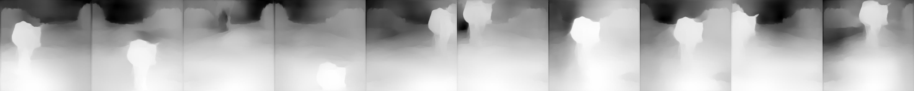

# Team Members(size=1):
   Name:Gadiraju Sanjay Varma
   
   Email:18pa1a1211@vishnu.edu.in
# Session-15 Assignment Journey
  * This is the most memorable course.I learned a lot from this course.Thank you  rohan sir for letting this course at such a affordable        price with hands-on  assignments.
  * Okay.Now this ReadMe tells the process and steps i followed for this Assignment
  * Let us start with my journey of predicting masks and depth images if we given background with foreground image and a background image.
# Data
 * Data is the most important part in the deep neural networks.
 * So a highly qualified iq brain with millions of neurons will be wasted if there is no knowledge in it.
 * In the same way if we have a deep learning model with tens and thousands of neurons and weights then it  will be wasted if we have no      knowledge about features,patterns,Textures,parts of object and object(just a basic understanding of model) in those weights.
 * So data is having utmost importance in development of neural network
 * Without data millions of skip connections,Millions of receptive fields will get wasted and they would be no use.
 * So i kept it in mind while developing data from my model.
 * There are two important steps in the data part of deep learning
    *     Data collection
    *     Data processing in right format so that neural network receives.

 ## Data Collection
 
 ### Background image
 * So we now understood the importance of data.So now we will look into data collection.
 * Here initially i started with collection of background images.
 * I collected images the next day and send it to my team.
 * But my team members said that the images are not realistic and we are looking for some indian scene photos.
 * So i stared collecting the photos of indian backgrounds with my team mates for assignment 15A.
 * So the foreground object we choose is cow which is the most common animal on roads.
 * So we collected the Background images which are of some indian street photos which were covered with plastic, waste,roads and traffic     etc.
 * We filtered some of images and we spent msot of time for making the background more realistic.
 * Here are some of the images we collected for Background.
 * But after listening to your session we decided that background may or may not  be too realistic.So we also downloaded some animation    photos as background.
 ### background image
 
 
 
 ### Transparent Foreground image
 
 * so our work of collecting background images are completed so now we will start collecting foreground images especially transparent      images.
 * So initially we started collecting the foreground images (in our sense it is cow).We searched on internet about cows and we choose      the pictures where cow is most dominating in the pictures which might results in good depth and transparent images.So we started        collecting the cow images by working as team.
 * After collection of cow images we need to make them transparent.So we used this website called remove.bg where we just upload an        image and it will give the transparent images of foreground pbject by using machine learning.It is really cool.
 [link to remove.bg website](https://www.remove.bg/)
 * So by using this website we obtained the transparent images of cow.
 * However for several we still have to use lasso tool in Photoshop to make the foregrounds really stand out
 #### Transparent Foreground image
 
 
 ### Mask Calculation
 * So initially we have this transparent image with four channels while the extra channel is transparency channel
 * So our team looked upon the transparency channel and set the value 0 for pixel value 0 and pixel value 1 for value greater than 0
 * That gives good binary mask which is very good in quality of image.Even though it is not much useful to main assignment it is very       much helpful
 #### mask image of foreground
 
 
 ### Okay.We are on a good pace.We completed the process of data collection.Now we will look into the data preprocessing which is              crucial     step for our deep learning model.
 
 ## Data preprocessing for our model
 
  ### Foreground-background image generation
  * Now after we collected the foreground images and background images we started thinking of a algorithm of generating or laying fg on     bg
  * We almost spend a week on thinking about the placing of an foreground on background using image segmentation.
  * The main idea here is that we will do image segmentation of background image using [this colab](https://colab.research.google.com/github/lexfridman/mit-deep-learning/blob/master/tutorial_driving_scene_segmentation/tutorial_driving_scene_segmentation.ipynb).
  * The output of image will be a combination of some maps.We will try to find best place for our foreground object based on that map.
  * But after listening to your session i got that we can place the foreground object anywhere.Then we used good approach to place foreground on background
  We planned to pass 2000 images in a single batch to the Depth image generator. Since 1 background will have 2000 images with 100 foregrouds (each 20 times) and another 2000 for same foreground images flipped, we ran the batch twice, second time with foregrounds flipped.

* Below is the process for one batch. 
* **NOTE**: We did not separately save corresponding bg, since the way we processed the image, from the image number we can determing the bg image number that we used.

```
INPUT bg image, list of fg images
1 for each foreground in list
  1.1 repeat 20 times
    1.1.1. randomly pick a center point on image (two numbers in range 0 to 447 for x, y)
    1.1.2. randomly pick a scale between .3 and .6 indicating how much square area should fg overlap on bg
    1.1.3. resize the fg to scale and place it on top of bg centered at x, y calculated
    1.1.4. save it at 160x160 resolution in a zip folder
    1.1.5. calculate mask by setting a binary image to transparency channel of fg image, with trasparent = 0 amd non transparent=1
    1.1.6. save mask at 160x160 resolution
    1.1.7. add 448x448 image to numpy array for depth calculation
1.3 if 100 images generated then yield the batch
  
2. run depth for one batch
3. save depth images of 160x160 in zipfolder
```
* Here we used perspective projection which means that if foreground object is in bottom of image then we will increse its scale
  because we assume that it is near to us.
 * If a foreground image is in above portion of image we are going to choose small scale since it is away from camera which is assumed by us.
 ### Example of foreground_background image
 
 
 ## Mask calculation of foreground_background image
 * So when we are generating the foreground_background image we are using **Image.paste()** which is the best function used in image processing.
 * So in that function we are using foreground image to paste on backgroound image using some co-ordinates which were obtained in random order between some range
 * Now we will create a black image with size of background image.
 * Now we will store that co-ordinates and we will paste the foreground on black image at that co-ordinate.
 * Now we will go through the image(iterate) and if there is any value greater than 0 we will make it as 1 otherwise we will make it as 0.
 * So by using this method we generated the mask of cow which is layed on background image.
 ### here are some of the images which are obtained from the mask of fg_bg image
 
 
## Depth Calculation
* We used nyu.h5 model for depth calcualtion from [dense depth](https://github.com/ialhashim/DenseDepth). This model requires input        images to be of 448x448 resolution and produces 224x224 size depth image. We planned to run it with a batch of 1000.
* Since we run 2000 images at a time now we wil generate 2000 images of size 224X224.Now we will scale those images to 448X448 because the model which we are using for generation of depth images will accept the input of 448X448.It produces the output of 224X224.After getting those images we will resize them to 160X160 size which is a compromise we took for speed and accuracy
* Now in the batch we are generating 2000 images and we will send all those images to depth prediction and save it to zip folder directly.
* Now we will use those images for our deep neural network.
### here are some of the examples for calculation of depth images for fg_bg image 
 
 
 ## Problems we faced and how we solved it during data processing
 * The first problem is generation of 1200K images!!!!!!!!!!!!!!!!.
 * The input and output operations performed in drive are very limited.So we cannot save 1200K images ondrive easily
 * When we are saving images in drive it will also create the preview of that images which results in lot of time consumption.
 * so we will generate the zip file where we are saving images in the zip file where drive will not generate the preview which results 
  in saving of time.
  * Also we are transferring only one file (independent of size) zip file.so we can transfer it to drive.
  * The zip file size if 3.2 GB.
  * After Extraction the size will be around 4 GB
 
 ### Hello sir.Okay we now also completed the data processing steps which is most crucial for our deep neural network
 [Here is the link to our colab file for complete data processing steps]()
 
 # Data Loading in Colab file
 * The data loading means making our data feasible such that our network will accept the data and produce the results.
 * Here the data loading in colab file is divided into many parts.We will explain each of the parts in detail.
 * 1) Bringing the zip file from google drive to our colab virtual environment directory.
 * 2) Extracting the zip file in the local colab virtual environment directory.
 
 ## Bringing the zip file from google drive to our colab virtual environment directory.
 * Now we completed the making of data.we have to load the data into our google colab.We can even work on our drive but the i/o operations performing on drive are very less.So we have to save them intoo our local colab machine.
 * I just performed the series of steps which worked really well.Since google colab s cloud based engine it is just sharing data so process is very easy.
 * Now initially we have to mount our drive to google colab.So by doing this we will get access to our drive form our colab.This makes life easier for small datasets.
 * Now we have to create folder in drive where we will have the background images and zip file for accessing.
 ### code for mounting our drive
 ```
   from google.colab import drive
   drive.mount('/content/drive')
 
 ```
* So after mounting drive we will make a directory in colab vm ***data*** where our data will be stored.
* Now we have to take that folder in drive and drag and drop the folder to our local colab file data
* After drag and drop our contents section will get struck(i suppose the copying of file is happening).Wait for a minute and **turn off internet and dont restart runtime.After two minutes turn on your internet and let google colab conect itself.**
* Now open data folder.Surprise!!!!!!!! the data is presented there.We have the zip file and bg images in that.Now when we go to drive we can find that our folder is deleted in drive.
*  DONT WORRY we can go to trash and restore it(Google is great).
* Now we got the zip file and bg images in our colab vm.

## Extracting the zip file in the local colab virtual environment directory.
 * Now we have the  zip file now we need to extract the colab file.So we need to go to the folder by using **cd** option in colab.
 * Next we need to run the below code to keep the zip file extracted portion in our same directory
 ```
 import time
start=time.time()
from zipfile import ZipFile
# Create a ZipFile Object and load sample.zip in it
#Copy of fgbganddepth_finaldata.zip is name of our zip file
with ZipFile('Copy of fgbganddepth_finaldata.zip', 'r') as zipObj:
# Extract all the contents of zip file in current directory
  zipObj.extractall()
print(time.time()-start)
 
 ```
 * The below code will extract the zip file and place it in same directory.
 * It took around 5 minutes for complete extraction of 5 GB.
 
 ### Hello sir now we also completed the extraction of zip file in colab local virtual machine folder.Next we will look into the loading of data so that our network takes it
 
 # Loading of data in batches for our network
 
 * Loading of data in bacthes is one of the most important part in neural network.
 * Loading of data in batches has many advantages like good loss backpropagation and identifying more generalized features.
 * Hence we prefer loading data in batches to our network.
 The loading of data in batches has several steps:
 * 1) Resizing them so that every image follows the rule of architecture(i.e) input and output size.(This is my team personal                  mistake.We forget to resize depth images,So i have to to do it everytime.)
  * 2) Having an access to all the respective files of images.
  * 3) Making sure we have all the inputs and ouputs in a single list so accessing them would be easier and also shuffling them also            would be easier
  * 4) visualization of the dataset list folder images
  * 5) Splitting the entire images into two sets one is train dataset and other is test dataset.
  * 6) Finding mean and standard deviation of the foreground and background,background,mask and depth images.
  * 7) Main part loading the dataset int the format of batches by creating a class
  * 8) Applying the transformations
  * 9) Loading the dataset by calling the dataset
  * 10) Loading the dataset by calling Dataloder class
  * 11) Finally Visualizing the dataset
  
  
## Resizing them so that every image follows the rule of architecture(i.e) input and output size.(This is my team personal                  mistake.We forget to resize depth images,So i have to to do it everytime.)
* One of the mistakes that we did while doing assignments is the size of images.We confirmed the size as 224X224 but we left the size of   background and depth as 448X448.So it is a major issue and it consumes a lot of time.
* But after realizing this we again ran an script to resize images in such a way we would benefit from both speed and accuracy.So we pick an size 160X160.Then we permanently made those changes in the zip folder.
* But we have to do resize of background images because i forgot about them and i need to resize them to 160X160 everytime so that all the images is of same size.
* Generally the resizing took only 1 second bcz we have to resize only 100 background images and since we are copying paths there is no need to have 400K background images.
* After doing the resize every image is in the shape of 160X160 which is good.
* So these are the resizes which are being done during this assignment.
 

  
  ## Having an access to all the respective files of images
  * So after extracting the dataset we need to access the files.
  * One way of accessing of files is by storing the images in a list.NOOO that woulg be memory intensive and takes a lot of memory.
  * Next method is by storing the paths.So one advantage is that if we store the images in paths there will be no memory intensive tasks.
  * Next is when we are trying to access the images during training,intially we will read images from paths and will send into neural network.
  * I followed this approach in a small dataset and for one epoch for loading paths took 44 secinds to complete while one epoch for         loading images took 35 seconds which is  faster but our dataste is larger so we will use loading paths format.
  * Below is the code for storing paths of images into a list
  ### foreground on background code for loading path into list

``` fg_bg_images=[]
from tqdm import tqdm_notebook
for i in tqdm_notebook(range(400000)):
      fg_bg_images+=["/content/data/dataset_forAssignment/output/images/fgbg{}.jpg".format(str(i).zfill(6))]
```
  

  ### loading background images paths into a list
  
  ```
  bg_images=[]
for i in tqdm_notebook(range(1,7)):
      for k in range(4000):
        bg_images+=["/content/data/dataset_forAssignment/bg_images/Copy of bgimg{}.jpg".format(str(i).zfill(3))]
  ```
  * Here we are storing each background image path 4000 times because each background images give 4000 images.
  
  ### loading mask images paths in list
  
  
  ```
  
  masks_images=[]
for i in tqdm_notebook(range(24000)):
      masks_images+=["/content/data/dataset_forAssignment/output/masks/mask{}.jpg".format(str(i).zfill(6))]
  ```
  
  ### loading depth images paths into list
  
  ```
  depth_images=[]
for i in tqdm_notebook(range(24000)):
      depth_images+=["/content/data/dataset_forAssignment/output/depth/fgbg{}.jpg".format(str(i).zfill(6))]
  ```
  
 * In this code we will load the foreground lay on background images **paths** into a list.
 * This similar approach is used for the depth images,background images and mask images.
 * So now we have access to all the files in the dataset in the format of the paths.
 
 ## Making sure we have all the inputs and ouputs in a single list so accessing them would be easier and also shuffling them also            would be easier

* So we initially loaded the fg_bg images,bg images,mask images and depth images **paths** into respective lists.
* But it will not help us because the accessing will not be easier and for any input there will be a fixed output only.
* So we need to maintain their relationship and at the same time we also have to  random shuffle and also easier accessing.OMG is it       possible?????
* Yes it is possible.Now we want to consider in such a way that all the index 0 elements are belonged to one set and all the index1 elements are belonged to one set and so on. 
* So we need to use below code such that all the list elements will be arranges such that all the same index elements form a nested list item.
```
Example:
input:[1,2,3],output=[4,5,6]
dataset=list(zip(input,output))
dataset=[[1,4],[2,5],[3,6]]

code:
dataset=list(zip(fg_bg_images,bg_images,masks_images,depth_images))
random.shuffle(dataset)
```
### So by this we will contain all inputs,outputs into a nested list

* So by using the above code we are going to have all the respective lists into single lists and easier for random shuffling and accessing.
* random.shuffle(dataset) will help us to shuffle the list so we can have images not in particular order.

## Visualization of the dataset folder by using the list.
* Let us consider the dataset folder is one which contains all the respective nested lists.
* Now below is the code fro displaying of images in those dataset folder.
```
# just some random visualization of the dataset folder
img1=Image.open(dataset[10][0])  #foreground_background image
display(img1)
img1=Image.open(dataset[10][1])  #background image
display(img1)
img1=Image.open(dataset[10][2])  # mask image
display(img1)
img1=Image.open(dataset[10][3])  # depth image
display(img1)


```
* Below is the output of the above code


* So by using this dataset method we have a lot of flexibility for this method.

## Splitting the dataset folder into two sets which are train set and test set

* So here we have a dataset folder where it contains all the images inside nested lists in it.
* So we need to divide this dataset into two parts such that train part gets 70% of dataset folder and test part contains 30% of dataset folder.
* Now we can apply different procedures that are applied to train on train folder and to test on test transforms
* Below is the code for the division of dataset folder into train and test folder.
```
train_dataset=[x for i,x in enumerate(dataset) if (i<(0.7*len(dataset)))] 
test_dataset=[x for i,x in enumerate(dataset[(int)(0.7*len(dataset)):]) if (i<(0.3*len(dataset)))]

# here we are taking length of dataset folder for division of the folder into two parts.
```

## Clearing of lists

* Here we have so many lists which contain around 4 lahks data which occupy data and memory in ram.So we need to clear all the lists after getting train_dataset and test_dataset.

* Below is the code for clearing the lists
```
depth_images.clear()
masks_images.clear()
bg_images.clear()
fg_bg_images.clear()
dataset.clear()
```
* It is a python function which cleares all the data in a particular list.
* It reduces the ram usage and help us get out of cuda out of memory error. 


